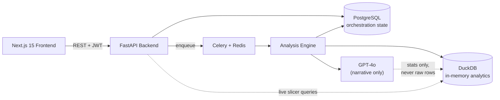

# Zephyr — AI Dashboard Generator

**Turn a raw spreadsheet into a complete, evidence-grounded executive analysis — KPIs, charts, forecasts, anomalies, a Decision Feed, and a natural-language chat interface — in seconds, with zero configuration.**

A full-stack, production-shaped data analytics platform: async FastAPI + Celery pipeline, DuckDB-backed statistical engine, PostgreSQL for orchestration state, and GPT-4o for narrative interpretation — deliberately called *after* every number is already correct, not before.

---

## For reviewers: how this repo is organized

This README covers the product. The **`docs/analytics/`** folder is a from-scratch analytics-engineering review of the codebase — data architecture, a reusable data quality framework, a KPI/metric glossary, ER diagrams, a dashboard specification, worked business insights on a real dataset, and an explicit breakdown of what's deterministic vs. AI-generated in this system, with the hallucination-prevention mechanisms actually implemented in code. It's written to be checked against the source, not taken on faith — every non-obvious claim cites a `file:line`.

| Document | What it covers |
|---|---|
| [`docs/analytics/01_Data_Architecture.md`](docs/analytics/01_Data_Architecture.md) | Sources, ETL pipeline stage-by-stage, transformations, cleaning, deduplication, joins, calculated fields, known engineering gaps |
| [`docs/analytics/02_Data_Quality_Framework.md`](docs/analytics/02_Data_Quality_Framework.md) | The pipeline's internal quality detector *and* a standalone, dependency-free, reusable validation framework with a runnable CLI |
| [`docs/analytics/03_Analytics_Glossary.md`](docs/analytics/03_Analytics_Glossary.md) | Every KPI type, calculation formula, aggregation rule, and the six distinct meanings of "confidence" in this system |
| [`docs/analytics/04_SQL_Standards.md`](docs/analytics/04_SQL_Standards.md) | Query-by-query SQL review, a real duplicate-code fix, and standards derived from the codebase's own best examples |
| [`docs/analytics/05_Data_Modelling.md`](docs/analytics/05_Data_Modelling.md) | Full Postgres ER diagram, normalization analysis, why the analytical layer isn't a star schema — plus a proposed dimensional model for a hypothetical cross-analysis feature |
| [`docs/analytics/06_Dashboard_Specification.md`](docs/analytics/06_Dashboard_Specification.md) | The dashboard that ships, and a specified (not built) executive/ops dashboard for the product itself — every metric checked against the real schema for whether it's actually computable today |
| [`docs/analytics/07_Business_Insights.md`](docs/analytics/07_Business_Insights.md) | Worked analyst findings — growth, seasonality, an injected anomaly, driver analysis — computed independently against the demo dataset |
| [`docs/analytics/08_AI_Analytics_and_Guardrails.md`](docs/analytics/08_AI_Analytics_and_Guardrails.md) | Every AI touchpoint, six concrete hallucination-prevention mechanisms, and where the guardrails stop |
| [`docs/analytics/10_Confidence_Calibration.md`](docs/analytics/10_Confidence_Calibration.md) | Measuring whether recommendation confidence means anything: a planted-truth benchmark run through the production pipeline, an LLM judge checked against deterministic labels, and a production feedback loop |
| [`ANALYTICS_PORTFOLIO_REPORT.md`](ANALYTICS_PORTFOLIO_REPORT.md) | Self-assessed maturity scoring and what a top-tier version of this portfolio would still need |

---

## The business problem

Turning raw business data into a decision takes hours of manual Excel/BI work, requires SQL or DAX skill most operators don't have, and produces static, one-off outputs that are stale the moment they're shared. Existing BI tools (Power BI, Tableau, Looker) are configuration-heavy and have no AI-native narrative layer; conversational AI tools (ChatGPT) answer questions about data but produce nothing persistent, shareable, or grounded in verifiable computation. See [`docs/01_Vision.md`](docs/01_Vision.md) for the full competitive analysis.

## The solution

Upload a file. Get a complete analysis: automatically detected KPIs, auto-selected charts, a written executive summary, forecasts, anomaly detection, a prioritized action list, and a chat interface to interrogate the data further — all computed deterministically first, narrated by an LLM second, and never the other way around. See [`docs/analytics/08_AI_Analytics_and_Guardrails.md`](docs/analytics/08_AI_Analytics_and_Guardrails.md) for exactly why that ordering is the core architectural decision in this codebase.

---

## Architecture



| Layer | Technology |
|---|---|
| Frontend | Next.js 15 · React 19 · TypeScript · Tailwind CSS v4 |
| State/Data | TanStack Query 5 · Zustand 5 · Apache ECharts |
| Auth | Supabase Auth (JWT, JWKS-verified server-side, fail-closed) |
| Backend | FastAPI 0.115 · Python 3.12 · SQLAlchemy 2.0 async |
| Queue | Celery 5 · Redis 7 |
| Analytics engine | DuckDB 1.2 · Polars · Pandas · NumPy |
| AI | OpenAI GPT-4o (narrative + chat) · `text-embedding-3-small` (category normalization) |
| Database | PostgreSQL 16 |
| Container | Docker · Docker Compose |

Full stage-by-stage data flow: [`docs/analytics/01_Data_Architecture.md`](docs/analytics/01_Data_Architecture.md).

---

## What it actually does

- **Zero-configuration KPI detection** — classifies numeric columns by name/shape into 15+ business KPI types (revenue, profit, orders, churn, MRR, AOV, ...), each with the correct aggregation (sum vs. average) and currency formatting. [Full logic →](docs/analytics/03_Analytics_Glossary.md#2-kpi-types-and-calculation-logic)
- **Auto chart selection** — bar, line, pie/donut, scatter, chosen by data shape (time-series presence, correlation strength, cardinality), capped and ranked, not user-configured.
- **Forecasting** — deterministic OLS trend extrapolation with a confidence score derived from history length and residual noise, not a black box. [Formula →](docs/analytics/03_Analytics_Glossary.md#4-forecast-metrics)
- **Anomaly detection** — statistical z-score outliers (row-level and monthly time-series), verified against a real injected anomaly in this repo's own demo dataset. [Worked example →](docs/analytics/07_Business_Insights.md)
- **Data quality scoring** — severity-weighted issue detection (missing values, duplicates, outliers, referential "part exceeds whole" checks) baked into every analysis, plus a standalone, dependency-free validation framework you can run against *any* CSV. [Try it →](docs/analytics/02_Data_Quality_Framework.md#running-it)
- **AI narrative & chat** — grounded exclusively in pre-computed statistics (never raw rows), behind an explicit anti-hallucination system prompt, a JSON schema, server-side sanitization, and a three-tier fallback that degrades to a fully deterministic summary rather than ever forcing a bad answer. [Full breakdown →](docs/analytics/08_AI_Analytics_and_Guardrails.md)
- **Measured, not claimed, confidence** — a planted-truth benchmark runs synthetic datasets through the production pipeline and scores every recommendation against the truth (held-back months for forecasts). It found every rule-based source overconfident — the data-quality rule claimed 0.90 and was right 49% of the time — and the measured values now replace the hand-set ones. Owners' 👍/👎 on each recommendation feed a production calibration view. AI-tier confidence is still unmeasured, and says so. [Method and results →](docs/analytics/10_Confidence_Calibration.md)
- **Live cross-filtering** — dashboard slicers re-aggregate via parameterized DuckDB queries with an explicit column-role allowlist, not free-form user-controlled SQL.

---

## Data quality, demonstrated

This repo includes a real, reusable data-quality validation framework (`backend/app/analytics/data_quality_checks.py` — stdlib-only, 8 check types, 20 passing tests) with a runnable CLI:

```bash
python backend/scripts/data_quality_report.py backend/scripts/demo_data/northwind_outfitters_sales.csv \
    --date-column week_start_date \
    --outlier-column revenue --outlier-column marketing_spend \
    --required-column region --required-column category
```

Sample output committed at [`backend/scripts/demo_data/sample_data_quality_report.md`](backend/scripts/demo_data/sample_data_quality_report.md) — 99/100, correctly isolating a deliberately-injected revenue anomaly (verified z-score ≈ 4.6) without a single false positive elsewhere in 936 rows.

---

## Data sources

| Source | Format | Notes |
|---|---|---|
| User-uploaded file | `.csv .xlsx .xls .json .parquet .tsv` | Up to 512MB; the only ingestion path — no live/streaming/database connectors by design ([`docs/02_Product_Requirements.md §14`](docs/02_Product_Requirements.md)) |
| `backend/scripts/demo_data/northwind_outfitters_sales.csv` | CSV | Synthetic, generated for this repo's own demos — 936 rows, 18 months, a verified statistical anomaly. [Details →](backend/scripts/demo_data/README.md) |

---

## Validation

**257 backend tests passing, 0 failing** — 22 files, covering the deterministic analytics pipeline (statistics, KPI detection, chart selection, semantic typing, data quality, live-filter re-aggregation, file cleaning), auth (real JWT signing/verification, not mocked), the standalone data quality framework (`test_data_quality_checks.py`), and the AI guardrail layer (`test_ai_service.py`: response parsing, chart allow-listing and executable-value filtering, recommendation normalization, and the Responses API → Chat Completions → deterministic fallback chain, all against a fake OpenAI client). Writing those tests surfaced two real bugs, both now fixed with regression tests: the chart safety filter substring-matched `nan`, silently dropping any chart with a label like "Finance" or "Maintenance", and `"$1.5M"` parsed as `1.5`. Also covered: confidence calibration (`test_calibration.py`), the calibration benchmark harness including one dataset end to end through the real pipeline (`test_calibration_eval.py`), and recommendation feedback against a real Postgres database (`test_recommendation_feedback.py` — CI's service container; skipped when none is reachable). `cd backend && pytest` runs from a clean clone with nothing exported — see [`docs/analytics/09_Verification.md`](docs/analytics/09_Verification.md) for the environment diagnosis behind that, and [`ANALYTICS_PORTFOLIO_REPORT.md`](ANALYTICS_PORTFOLIO_REPORT.md) for how testing factors into the maturity scoring.

---

## Quick start

### Prerequisites
- Docker 24+ and Docker Compose
- Node.js 20+ (CI uses 20; on Node 25, `npm run dev` adds the flag Next's dev overlay needs automatically)
- Python 3.12 (pinned in `backend/.python-version`, matching the Docker image — the pinned dependencies don't build on 3.14)

### 1. Clone and configure
```bash
git clone https://github.com/your-org/ai-dashboard-generator.git
cd ai-dashboard-generator
cp .env.example .env
```
Fill in `.env`: `OPENAI_API_KEY` (from https://platform.openai.com) and `SUPABASE_URL` / `SUPABASE_ANON_KEY` / `SUPABASE_SERVICE_ROLE_KEY` / `SUPABASE_JWT_SECRET` (from your Supabase project).

Running the frontend outside Docker (`npm run dev` in `frontend/`)? Next.js only reads env files from its own directory, so copy the `NEXT_PUBLIC_*` lines into `frontend/.env.local` (gitignored) — without them every page returns 500.

### 2. Start everything
```bash
make setup   # installs deps, runs migrations
make dev     # starts all services
```
- Frontend: http://localhost:3000
- Backend API: http://localhost:8000/api/v1
- API Docs: http://localhost:8000/api/docs

### 3. Verify health
```bash
bash scripts/health_check.sh
```

### Development commands
```bash
make dev          # Start all services (Docker + hot reload)
make test         # Run all tests
make lint         # Run ruff + mypy + eslint
make migrate      # Run pending DB migrations
make seed         # Seed DB with demo data
make logs         # Tail all service logs
make clean        # Stop all containers
```

---

## Project structure

```
.
├── frontend/           # Next.js application
│   └── src/{app,components,hooks,lib,stores,types}
├── backend/
│   ├── app/
│   │   ├── analytics/  # Deterministic engines — statistics, KPI, charts, forecasting,
│   │   │                 anomaly detection, data quality (zero AI calls in this package)
│   │   ├── api/        # Route handlers
│   │   ├── core/       # Config, logging, security, rate limiting
│   │   ├── models/     # SQLAlchemy ORM
│   │   ├── schemas/    # Pydantic request/response contracts
│   │   ├── services/   # AI integration, file processing, orchestration
│   │   └── workers/    # Celery tasks
│   ├── alembic/        # Database migrations
│   ├── scripts/        # Setup, seed, health check, data quality CLI, demo data
│   └── tests/
├── docs/
│   ├── analytics/      # ← Analytics engineering review (this section of the README)
│   └── *.md            # Product docs — vision, PRD, personas, roadmap
├── docker/              # Dockerfiles + nginx config
└── .github/workflows/   # CI/CD pipelines
```

---

## Screenshots

Not included in this pass — generating them requires a live Supabase project and a running Docker stack, which wasn't set up as part of this documentation/quality review (see [`ANALYTICS_PORTFOLIO_REPORT.md`](ANALYTICS_PORTFOLIO_REPORT.md) for why that was judged out of scope rather than silently skipped). To capture your own: `make dev`, sign in, upload `backend/scripts/demo_data/northwind_outfitters_sales.csv`, and screenshot the resulting dashboard.

---

## Roadmap

Full roadmap: [`docs/06_Feature_Roadmap.md`](docs/06_Feature_Roadmap.md). Near-term highlights: correlation-analysis insights, seasonal pattern detection, categorical/date-range dashboard filters, and — directly motivated by this review — a calibrated (not fixed-lookup) confidence score for AI recommendations, and closing the three schema gaps identified in [`docs/analytics/06_Dashboard_Specification.md §2.10`](docs/analytics/06_Dashboard_Specification.md#210-summary--whats-blocking-a-real-executive-dashboard-today) that currently block a real business-operations dashboard for the product itself.

---

## Environment variables

See `.env.example` for all available options. Required for production: `SECRET_KEY`, `OPENAI_API_KEY`, `SUPABASE_URL`, `SUPABASE_ANON_KEY`, `SUPABASE_SERVICE_ROLE_KEY`, `SUPABASE_JWT_SECRET`, `POSTGRES_*`, `REDIS_HOST`.

## Deployment

**Vercel + Railway (recommended)**: deploy frontend to Vercel, backend + worker + Redis + Postgres to Railway, set env vars in both.

**Docker (self-hosted)**: `docker compose -f docker-compose.prod.yml up -d`

## License

MIT — see [LICENSE](LICENSE)
