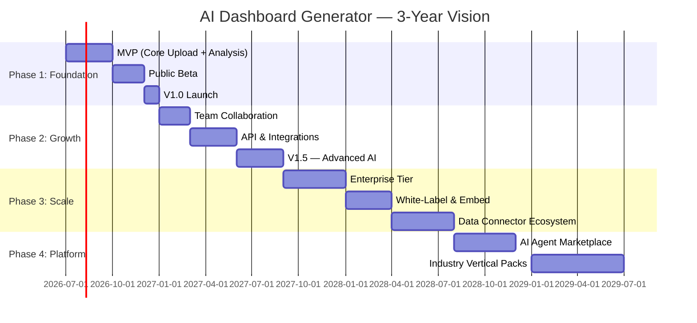

# 01 — Vision

> **Document:** AI Dashboard Generator — Product Vision  
> **Version:** 1.0  
> **Last Updated:** 2026-06-25  
> **Status:** Approved  
> **Owner:** Product & Strategy

---

## Table of Contents

1. [Mission Statement](#1-mission-statement)
2. [Product Vision](#2-product-vision)
3. [Target Users](#3-target-users)
4. [Core Problem](#4-core-problem)
5. [Existing Market Problems](#5-existing-market-problems)
6. [Design Philosophy](#6-design-philosophy)
7. [Unique Value Proposition](#7-unique-value-proposition)
8. [Product Principles](#8-product-principles)
9. [Success Metrics](#9-success-metrics)
10. [Long-Term Vision — 3-Year Roadmap](#10-long-term-vision--3-year-roadmap)

---

## 1. Mission Statement

> **"To give every business the intelligence of a world-class data team — instantly, automatically, and beautifully."**

AI Dashboard Generator exists to democratise business intelligence. We eliminate the weeks of analyst time, the expensive BI licences, and the steep learning curves that currently sit between a business and its own data.

Any professional — regardless of technical skill — should be able to upload a spreadsheet and receive a complete, executive-grade business analysis in seconds. Not a chart. Not a table. A complete analysis: KPIs, trends, anomalies, forecasts, recommendations, and a natural-language AI they can interrogate.

---

## 2. Product Vision

AI Dashboard Generator is the **world's first zero-configuration business intelligence platform**. It is designed from first principles for the post-AI era, where the act of building a dashboard is as obsolete as building a website from raw HTML.

The vision is a product that feels less like software and more like a brilliant analyst who works at superhuman speed:

- You hand them your data.
- They return a complete picture of your business.
- They proactively tell you what matters, what changed, and what to do next.
- They answer any follow-up question instantly.

The product aesthetic is influenced by:

| Influence | What we take from it |
|-----------|----------------------|
| **Apple** | Opinionated defaults, hardware/software harmony, feeling of inevitable correctness |
| **Linear** | Speed, keyboard-first UX, surgical minimalism, no cognitive overhead |
| **Notion** | Flexible information architecture, collaborative, joy in everyday use |
| **Stripe** | Developer-grade precision, trust through transparency, beautiful documentation |

The product must feel like it was built in a parallel universe where BI was invented after the AI revolution, not before.

---

## 3. Target Users

AI Dashboard Generator targets **data-curious business professionals** — people who need answers from data but do not identify as data analysts and do not want to become one.

### 3.1 Primary Segments

| Segment | Description | Size Estimate |
|---------|-------------|---------------|
| **SMB Owners & Founders** | 1–50 person companies; owner wears multiple hats; no dedicated analyst | 33M businesses (UK + US) |
| **Mid-Market Managers** | Department heads in 50–500 person firms; responsible for reporting to leadership | 12M professionals |
| **Consultants & Advisors** | External consultants who analyse client data and need fast turnaround | 4M professionals |
| **Startup Teams** | Fast-growing teams who move too quickly for traditional BI tooling | 600K startups |

### 3.2 Secondary Segments

| Segment | Description |
|---------|-------------|
| **Data Analysts** | Power users who want AI augmentation and faster prototyping |
| **Enterprise Teams** | Large organisations who want self-serve analytics without BI sprawl |
| **Educators & Researchers** | Academic users who need to rapidly analyse survey or experiment data |

### 3.3 Anti-Persona

The product is **not** designed for:

- Professional BI developers building complex enterprise data warehouses.
- Data engineers who need full SQL access and custom transformation pipelines.
- Users who require pixel-perfect, fully custom visualisations.

These users are better served by existing tools. Attempting to serve them risks compromising the simplicity that defines AI Dashboard Generator.

---

## 4. Core Problem

**The gap between data and decisions is too wide.**

Every business generates data. Most businesses cannot act on it. The barrier is not access to data — it is the infrastructure, skill, and time required to transform raw data into insight.

### 4.1 The Current Reality

A typical business intelligence workflow looks like this:

```
Raw Data → Export to CSV → Open Excel → Build Pivot Tables
→ Create Charts → Write Commentary → Email to Stakeholders
→ Repeat every week
```

This process:
- Takes 4–20 hours per report cycle.
- Requires intermediate-to-advanced Excel or SQL skills.
- Produces static outputs that are out of date by the time they are shared.
- Does not produce recommendations — only descriptions.
- Creates tribal knowledge bottlenecks around the analyst who built the report.

### 4.2 The Desired Reality

```
Upload Data → Receive Complete Analysis (< 10 seconds)
→ Interactive Dashboard → AI Chat → Export
```

AI Dashboard Generator closes this gap entirely.

---

## 5. Existing Market Problems

### 5.1 Why Current BI Tools Are Too Complicated

The traditional BI market was designed for a world where:
1. Data lived in relational databases and required SQL expertise to query.
2. Dashboards were built by dedicated BI developers, not end users.
3. "Self-service" meant drag-and-drop, not zero-configuration.

This has produced tools with fundamental UX debt:

#### Power BI
- Requires DAX formula knowledge for any meaningful calculation.
- Desktop application — not web-native.
- Connectors require IT administration.
- Average time to first meaningful dashboard: **4–12 hours**.
- Power Query learning curve is steep for non-technical users.

#### Tableau
- Visual Query Language is powerful but opaque.
- Licencing is cost-prohibitive for SMBs (> £70/user/month).
- No AI-native analysis; Tableau AI is bolted-on.
- Requires data preparation in separate tools before meaningful use.

#### Looker
- Enterprise-only pricing.
- Requires LookML (a proprietary data modelling language).
- Deployment requires engineering resource.
- No self-serve story — it is a developer tool.

#### Common Problems Across All Traditional BI Tools

| Problem | Impact |
|---------|--------|
| Require data modelling before use | Non-technical users blocked immediately |
| No built-in AI narrative | User sees charts, not conclusions |
| Configuration-heavy | Time to value is measured in days |
| Cannot infer data schema | User must manually map fields |
| No proactive recommendations | Passive reporting, not active guidance |
| Output is descriptive, not prescriptive | Tells you what happened, not what to do |
| Steep pricing for small teams | SMBs locked out of the market |
| No natural language query without add-ons | Analysts remain a bottleneck |

### 5.2 The AI Tool Gap

Recent AI tools (ChatGPT, Claude, Gemini) can answer questions about data — but only in a conversational, ephemeral way. They do not:

- Produce persistent, shareable dashboards.
- Maintain a living analysis that refreshes with new data.
- Provide branded executive reports.
- Integrate forecasting, anomaly detection, and correlation analysis in a single workflow.
- Deliver a structured decision feed — a prioritised list of actions.

AI Dashboard Generator is the first product to combine the analytical depth of traditional BI with the accessibility of conversational AI, inside a modern SaaS product experience.

---

## 6. Design Philosophy

> "The best interface is no interface."  
> — Golden Krishna

AI Dashboard Generator follows six design laws that govern every UI and UX decision:

### 6.1 Zero-Configuration First

The system must produce a complete, useful output with zero user configuration. If the AI can infer something, it must. Configuration is always opt-in, never required.

**Example:** The AI detects that a column named `revenue` contains currency values and automatically applies currency formatting, aggregates it by month, and surfaces it as the primary KPI — without the user specifying any of this.

### 6.2 Progressive Disclosure

The default view is always the simplest possible view. Complexity is hidden one layer down. Users who want more control can access it; users who do not want it never encounter it.

**Example:** The Executive Summary is shown by default. The underlying chart editor is accessible via a chevron but not displayed by default.

### 6.3 Speed as a Feature

Perceived performance is a product feature, not an engineering concern. Every interaction should feel instant. Processing must be visibly progressing, never silently working.

**Target:** Upload → Analysis visible in < 10 seconds for files ≤ 5 MB.

### 6.4 Trust Through Transparency

Every AI-generated insight must cite its source data and display a confidence score. Users must always be able to understand *why* the AI said something.

**Example:**
> "Revenue declined 12% in March. [Confidence: 94%] Based on 847 transaction records in Q1_Sales.csv, rows 2–849."

### 6.5 Opinionated Defaults

The product makes strong, justified choices on behalf of the user. We do not ask users what chart type they want — we pick the correct one based on data type and relationship. Users can override defaults, but defaults are never neutral.

### 6.6 Radically Accessible Language

All AI output must be written in plain, executive-appropriate English. No jargon, no statistical notation in primary views, no unexplained acronyms. The insights should read like they were written by a thoughtful senior analyst.

---

## 7. Unique Value Proposition

> **AI Dashboard Generator turns any business data file into a complete executive analysis in under 10 seconds — no setup, no training, no analyst required.**

### 7.1 Differentiation Matrix

| Capability | AI Dashboard Generator | Power BI | Tableau | ChatGPT |
|-----------|------------------------|----------|---------|---------|
| Zero-configuration analysis | ✅ | ❌ | ❌ | Partial |
| Auto-generated executive narrative | ✅ | ❌ | ❌ | Partial |
| Built-in forecasting | ✅ | Partial | Partial | ❌ |
| Decision Feed / Recommendations | ✅ | ❌ | ❌ | ❌ |
| Persistent shareable dashboard | ✅ | ✅ | ✅ | ❌ |
| Natural language chat over data | ✅ | Add-on | Add-on | ✅ |
| SMB-accessible pricing | ✅ | Partial | ❌ | ✅ |
| < 10-second time to insight | ✅ | ❌ | ❌ | Partial |
| Anomaly detection built-in | ✅ | Add-on | Add-on | ❌ |
| Exportable branded reports | ✅ | Partial | Partial | ❌ |

### 7.2 Core Value Pillars

1. **Instant** — From upload to full analysis in seconds, not hours.
2. **Intelligent** — AI does the analytical work, not the user.
3. **Actionable** — Every analysis ends with prioritised recommendations.
4. **Beautiful** — Output quality matches or exceeds professional design studios.
5. **Accessible** — Any professional can use it on day one, with zero training.

---

## 8. Product Principles

These eight principles are non-negotiable. Any feature, design decision, or engineering choice that violates a principle must be escalated to the product owner for review.

| # | Principle | Description |
|---|-----------|-------------|
| P1 | **Zero Friction** | Users should never be asked to configure what the AI can infer. |
| P2 | **Instant Gratification** | Upload to full dashboard in under 10 seconds for files ≤ 5 MB. |
| P3 | **Trustworthy Intelligence** | Every AI insight must include a confidence score and data citation. |
| P4 | **Progressive Disclosure** | Surface the simplest view first; complexity is opt-in. |
| P5 | **Opinionated Defaults** | Sensible defaults beat endless configuration options. |
| P6 | **Radically Simple UX** | If a feature requires a tooltip to understand, it is too complex. |
| P7 | **Privacy by Design** | User data is never used to train models; encryption at rest and in transit. |
| P8 | **Actionable Outputs** | Every analysis must conclude with at least one concrete, executable recommendation. |

---

## 9. Success Metrics

### 9.1 North Star Metric

> **Weekly Active Analyses** — the number of unique analyses completed by paying users in a 7-day window.

This metric captures both activation (new users completing their first analysis) and retention (returning users uploading new data).

### 9.2 Primary KPIs

| Metric | Definition | Target (Month 6) | Target (Month 12) |
|--------|-----------|-----------------|------------------|
| Time to First Insight (TTFI) | Seconds from upload completion to dashboard visible | < 10s (p95) | < 8s (p95) |
| Activation Rate | % of new sign-ups completing first analysis within 24h | > 60% | > 75% |
| Weekly Retention (W4) | % of users returning in week 4 after sign-up | > 35% | > 50% |
| Net Promoter Score (NPS) | Standard NPS survey at day 14 | > 40 | > 55 |
| Paid Conversion Rate | % of trial users converting to paid plan | > 8% | > 14% |
| Monthly Recurring Revenue (MRR) | Total recurring subscription revenue | £50K | £250K |
| Churn Rate (Monthly) | % of paying users cancelling per month | < 5% | < 3% |
| Average Revenue Per User (ARPU) | MRR ÷ paying users | £35 | £45 |

### 9.3 Secondary KPIs

| Metric | Definition | Target |
|--------|-----------|--------|
| Dashboard Share Rate | % of analyses shared externally | > 20% |
| Chat Engagement Rate | % of analyses followed by ≥1 chat message | > 40% |
| Export Rate | % of analyses resulting in an export | > 30% |
| Support Ticket Rate | Tickets per 100 active users per week | < 2 |
| Data Quality Pass Rate | % of uploads that produce a successful analysis | > 92% |

### 9.4 Anti-Metrics

These metrics indicate the product is heading in the wrong direction:

- Average analysis completion time > 30 seconds.
- > 15% of users requiring support to complete first upload.
- NPS < 20 at any point.
- More than 3 configuration steps required before insight is visible.

---

## 10. Long-Term Vision — 3-Year Roadmap



### 10.1 Year 1 (2026–2027): Foundation & Product-Market Fit

**Goal:** Prove the core proposition. Reach 1,000 paying customers. Achieve NPS > 45.

Key milestones:
- MVP launch: CSV and Excel upload → automated dashboard.
- Public beta: onboard 500 beta users across target segments.
- V1.0 GA: forecasting, decision feed, AI chat, PDF export.
- First enterprise pilot: white-glove onboarding for a mid-market customer.

**Success criteria:** 1,000 paying users by month 12. MRR > £50K. Churn < 5%.

### 10.2 Year 2 (2027): Growth & Expansion

**Goal:** 10,000 paying customers. Expand to team and enterprise tiers. Launch API.

Key milestones:
- Team collaboration features (shared workspaces, commenting, roles).
- REST API and webhook support for automated data pipelines.
- Native integrations: Google Sheets, Salesforce, Shopify, QuickBooks.
- Advanced AI: multi-file analysis, cross-dataset correlations, causal inference.
- V2.0: scheduling, automated report delivery, branded portals.

**Success criteria:** £500K MRR. Enterprise ACV > £12K. Team plan adoption > 30%.

### 10.3 Year 3 (2028–2029): Platform & Market Leadership

**Goal:** Become the category-defining AI analytics platform. £5M ARR. 50,000 paying users.

Key milestones:
- White-label and embedded analytics offering.
- AI agent marketplace (community-built analysis agents).
- Industry vertical packs (Retail, Finance, Healthcare, Logistics).
- Real-time data connectors (Snowflake, BigQuery, Redshift).
- Predictive modelling studio (no-code ML model building).
- International expansion: EU, US, Australia.

**Success criteria:** £5M ARR. Category leadership in "AI-native BI". Series A funding secured.

### 10.4 Strategic Bets

| Bet | Rationale |
|-----|-----------|
| AI-native from day one | Retro-fitting AI onto legacy BI architecture is impossible — building AI-native gives us a 3-year structural advantage |
| SMB as the entry wedge | SMBs are underserved, fast-moving, and vocal advocates if delighted — they become our distribution engine |
| Opinionated product | The market is saturated with configurable tools; an opinionated tool that "just works" is defensible |
| Executive narrative output | Charts commoditise; the ability to write quality business narrative is a durable AI moat |
| Decision Feed as differentiator | No competitor surfaces prioritised recommendations; this is the feature that changes the category definition from "BI tool" to "AI advisor" |
