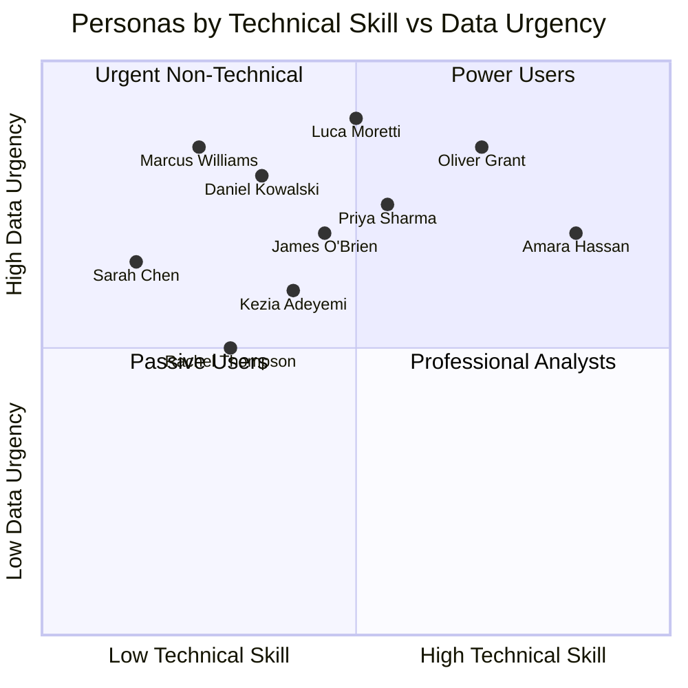

# 03 — User Personas

> **Document:** AI Dashboard Generator — User Personas  
> **Version:** 1.0  
> **Last Updated:** 2026-06-25  
> **Status:** Approved  
> **Owner:** UX Design & Product  
> **Related Documents:** [01_Vision.md](01_Vision.md), [04_User_Stories.md](04_User_Stories.md), [05_User_Journey.md](05_User_Journey.md)

---

## Table of Contents

1. [Persona Overview](#1-persona-overview)
2. [Persona 1 — Sarah Chen, Small Business Owner](#2-persona-1--sarah-chen-small-business-owner)
3. [Persona 2 — Marcus Williams, CEO](#3-persona-2--marcus-williams-ceo)
4. [Persona 3 — Priya Sharma, Finance Manager](#4-persona-3--priya-sharma-finance-manager)
5. [Persona 4 — James O'Brien, Operations Manager](#5-persona-4--james-obrien-operations-manager)
6. [Persona 5 — Kezia Adeyemi, Marketing Manager](#6-persona-5--kezia-adeyemi-marketing-manager)
7. [Persona 6 — Daniel Kowalski, Sales Manager](#7-persona-6--daniel-kowalski-sales-manager)
8. [Persona 7 — Rachel Thompson, HR Manager](#8-persona-7--rachel-thompson-hr-manager)
9. [Persona 8 — Luca Moretti, Startup Founder](#9-persona-8--luca-moretti-startup-founder)
10. [Persona 9 — Amara Hassan, Data Analyst](#10-persona-9--amara-hassan-data-analyst)
11. [Persona 10 — Oliver Grant, Consultant](#11-persona-10--oliver-grant-consultant)
12. [Persona Comparison Matrix](#12-persona-comparison-matrix)

---

## 1. Persona Overview

These ten personas represent the primary and secondary user segments for AI Dashboard Generator. They are grounded in user research patterns from the SMB, mid-market, and consulting segments. Each persona is used to:

- Drive user story creation (see [04_User_Stories.md](04_User_Stories.md))
- Inform UX decision-making
- Prioritise features on the roadmap
- Guide onboarding and marketing messaging

---

## 2. Persona 1 — Sarah Chen, Small Business Owner

### Profile

| Attribute | Detail |
|-----------|--------|
| **Name** | Sarah Chen |
| **Age** | 38 |
| **Role** | Owner, Bloom & Bake (artisan bakery chain, 3 locations) |
| **Location** | Manchester, UK |
| **Team Size** | 12 employees |
| **Technical Skill** | Low — comfortable with Excel basics, no SQL, no BI tools |
| **Tools Used** | Square POS, Xero, Google Sheets, WhatsApp |
| **Device** | MacBook Pro (work), iPhone (personal) |

### Personality

Sarah is resourceful, fast-moving, and customer-obsessed. She trusts her gut but knows she needs data to back decisions when talking to her bank or landlord about expansion. She is not afraid of technology but resents tools that require learning curves she does not have time for.

> *"I just want to know if my new location is making money, and what I should do about it. I don't want to become a spreadsheet person."*

### Goals

1. Understand which products, locations, and time periods are most profitable.
2. Spot slow periods and plan promotions proactively.
3. Produce a simple report to show her accountant and bank manager.
4. Identify which staff costs are too high relative to revenue.
5. Reduce the time she spends on weekly financial review from 3 hours to 30 minutes.

### Frustrations

1. Her POS system gives her raw data but no insight — just tables.
2. She exports to Excel but doesn't know how to build pivot tables reliably.
3. She has tried Power BI once; the setup overwhelmed her in the first 10 minutes.
4. Reports she sends to her accountant are always manually assembled and error-prone.
5. She cannot easily compare performance across her three locations.

### Daily Workflow

- 6:00 AM: Opens bakery; handles morning rush.
- 9:00 AM: Reviews the previous day's Square POS summary (email).
- 12:00 PM: Admin: emails, supplier calls, staff issues.
- 3:00 PM: Checks Xero invoices.
- 5:30 PM: Closes up; sometimes exports weekly data but rarely analyses it deeply.
- **Data review: ad-hoc, triggered by a problem, not proactively.**

### Primary Use Cases

1. Weekly revenue analysis: upload week's POS export → understand top products and revenue by location.
2. Monthly P&L review: upload Xero export → quick executive summary for bank meeting.
3. Seasonal planning: 6 months' data → forecast busy periods, plan promotions.

### Pain Points

| Pain Point | Severity | How AI Dashboard Generator Solves It |
|-----------|---------|--------------------------------------|
| No time to build dashboards | Critical | Zero-config upload → instant dashboard |
| Cannot compare locations | High | Auto-segmentation by location column |
| Cannot forecast demand | Medium | Built-in forecasting on upload |
| Manual reporting | High | PDF export of professional dashboard |

### Expected Outcomes

- Reduces weekly data review time from 3 hours to 20 minutes.
- Identifies that Location 3 has 18% higher staff cost ratio — triggers cost review.
- Uses PDF export in bank meeting to secure £50K expansion loan.

### Willingness to Pay

- Comfortable with Pro plan at £29/month.
- Would not justify Business plan without clear team use case.

---

## 3. Persona 2 — Marcus Williams, CEO

### Profile

| Attribute | Detail |
|-----------|--------|
| **Name** | Marcus Williams |
| **Age** | 47 |
| **Role** | CEO, Apex Logistics Ltd (200-person logistics company) |
| **Location** | Birmingham, UK |
| **Team Size** | 200 employees across 4 departments |
| **Technical Skill** | Low-medium — strategic thinker; delegates technical detail |
| **Tools Used** | Salesforce, NetSuite, Slack, email |
| **Device** | iPad, MacBook, iPhone |

### Personality

Marcus is results-driven, data-informed but not data-literate in a technical sense. He expects his leadership team to surface insights, but is frustrated when those insights arrive too late, too raw, or too ambiguous to act on. He values clarity and speed.

> *"I have a board meeting every quarter. I need to know what's actually happening in this business — not a spreadsheet from last month."*

### Goals

1. Real-time visibility into company KPIs without depending on his finance team.
2. A single view of business health he can check in under 5 minutes.
3. Data-backed ammunition for board presentations.
4. Early warning on any department underperforming.
5. Ability to ask follow-up questions without waiting for an analyst.

### Frustrations

1. His finance team produces a monthly board pack that takes 3 weeks to prepare.
2. By the time he receives the report, the data is 30 days old.
3. He cannot ask the report a question — it just describes what happened.
4. His operations data sits in NetSuite and his sales data in Salesforce; nobody joins them.
5. He once tried ThoughtSpot; the IT setup took 6 weeks.

### Daily Workflow

- 7:30 AM: Reviews overnight email digest; flags issues.
- 9:00 AM: Exec team standup (30 min).
- 10:30 AM: Operational meetings / customer escalations.
- 2:00 PM: Reviews financial updates from Finance Director.
- 4:00 PM: Strategic planning work.
- **Data consumption: reactive. Waits for reports to come to him.**

### Primary Use Cases

1. Upload monthly operational KPI export → receive board-ready executive summary.
2. Upload sales pipeline data → understand deal velocity and forecast accuracy.
3. Ask AI: "Which service line has the lowest margin this quarter?"

### Pain Points

| Pain Point | Severity | How AI Dashboard Generator Solves It |
|-----------|---------|--------------------------------------|
| Stale, delayed reports | Critical | Instant analysis on upload |
| Cannot interrogate static reports | High | AI chat for follow-up questions |
| Dependency on analyst/Finance | High | Self-serve upload |
| No forward-looking view | High | Built-in forecasting |

### Expected Outcomes

- Cuts board pack preparation time by 60%.
- Identifies an underperforming service line 3 weeks earlier than the traditional reporting cycle.
- AI chat answers board members' questions live in the meeting.

### Willingness to Pay

- Business plan (£99/month) is justifiable for the time saving.
- Would evaluate Enterprise tier if team sharing becomes critical.

---

## 4. Persona 3 — Priya Sharma, Finance Manager

### Profile

| Attribute | Detail |
|-----------|--------|
| **Name** | Priya Sharma |
| **Age** | 33 |
| **Role** | Finance Manager, TechNova (80-person SaaS company) |
| **Location** | London, UK |
| **Team Size** | Finance team of 3 |
| **Technical Skill** | Medium-high — Advanced Excel, basic SQL, uses Xero and Float |
| **Tools Used** | Xero, Float, Google Sheets, Slack |
| **Device** | Windows laptop (work), Android phone |

### Personality

Priya is methodical, detail-oriented, and cautious. She trusts data but is sceptical of AI-generated conclusions until she can verify them. She values accuracy above speed, but still feels the pressure of producing monthly reports quickly.

> *"I need to trust the numbers. If an AI tells me revenue is up 12%, I need to know exactly which rows it calculated that from."*

### Goals

1. Produce monthly management accounts 50% faster.
2. Identify budget variances before month-end close.
3. Provide the CEO with a 30-second visual summary of financial health.
4. Model 3–6 month cash flow forecasts without a finance modelling tool.
5. Reduce the manual work of assembling charts for board presentations.

### Frustrations

1. Spends 2 days per month assembling charts manually in Excel/Google Slides.
2. Her CEO asks for last-minute analysis she cannot quickly produce.
3. Xero reports are formatted for accountants, not executives.
4. Building a cash flow forecast from scratch in Excel takes a full day.
5. She mistrusts AI tools that don't show their working.

### Daily Workflow

- 8:30 AM: Checks bank accounts and cash position.
- 9:30 AM: Processes invoices and expense approvals.
- 11:00 AM: Reviews financial reports; identifies anomalies.
- 2:00 PM: Prepares management pack (monthly cycle: 8 days/month).
- 4:30 PM: Cashflow modelling and budget vs actuals.

### Primary Use Cases

1. Upload month-end P&L export → AI generates executive narrative + charts.
2. Upload cashflow data → AI generates 3-month forecast with confidence bands.
3. Upload budget vs actuals → AI identifies significant variances and explains them.

### Pain Points

| Pain Point | Severity | How AI Dashboard Generator Solves It |
|-----------|---------|--------------------------------------|
| Manual chart creation | High | Auto-generated visualisations |
| Cannot verify AI calculations | Critical | Data citations on every insight |
| Time spent on narrative writing | High | Auto-generated executive summary |
| No built-in forecasting tool | Medium | Time-series forecast on upload |

### Expected Outcomes

- Monthly reporting time reduced from 2 days to 4 hours.
- Catches a £45K invoice processing error via anomaly detection before month-end.
- Board packs are consistently better-quality and produced faster.

### Willingness to Pay

- Pro plan (£29/month) is easily justifiable.
- Would upgrade to Business if team sharing is needed.

---

## 5. Persona 4 — James O'Brien, Operations Manager

### Profile

| Attribute | Detail |
|-----------|--------|
| **Name** | James O'Brien |
| **Age** | 41 |
| **Role** | Operations Manager, Meridian Manufacturing (150 employees) |
| **Location** | Leeds, UK |
| **Team Size** | Operations team of 15 |
| **Technical Skill** | Medium — comfortable with Excel, basic reporting tools |
| **Tools Used** | SAP (export only), Excel, email |
| **Device** | Windows desktop (work), Android phone |

### Personality

James is pragmatic and process-driven. He measures everything but does not have time to analyse everything. He manages a high-volume operation with many moving parts and needs visibility across multiple KPIs simultaneously.

> *"I track 30 KPIs. I need to know which ones are red this week — and why — before I even make my morning coffee."*

### Goals

1. Weekly operations dashboard: throughput, defect rate, downtime, delivery performance.
2. Proactive alerts on any KPI deviating from target.
3. Root cause analysis — not just "defect rate up 5%" but "defect rate up 5% in Line 3 on night shift."
4. Monthly report for the MD that doesn't take a full day to produce.
5. Forecast production capacity vs upcoming order book.

### Frustrations

1. SAP gives raw tables; he exports to Excel and manually builds pivot tables.
2. Building weekly ops reports takes 4 hours every Friday.
3. His MD wants one-page summaries; condensing a spreadsheet to one page is painful.
4. He cannot forecast easily — he uses last year's actuals as a proxy.
5. Root cause analysis requires manual data slicing that he finds tedious.

### Primary Use Cases

1. Upload weekly production data → KPI dashboard with red/amber/green status.
2. Upload defect log → anomaly detection to identify patterns by shift, machine, product.
3. Upload order book data alongside capacity data → capacity forecast.

### Pain Points

| Pain Point | Severity | How AI Dashboard Generator Solves It |
|-----------|---------|--------------------------------------|
| Weekly manual reporting | Critical | Automated dashboard on upload |
| No root cause capability | High | AI-generated segmentation insights |
| Cannot forecast capacity | High | Time-series forecasting |
| Producing one-page summaries | High | Executive Summary output |

### Willingness to Pay: Pro or Business plan depending on team use.

---

## 6. Persona 5 — Kezia Adeyemi, Marketing Manager

### Profile

| Attribute | Detail |
|-----------|--------|
| **Name** | Kezia Adeyemi |
| **Age** | 29 |
| **Role** | Marketing Manager, Greenpath Retail (e-commerce, 40 employees) |
| **Location** | Bristol, UK |
| **Team Size** | Marketing team of 4 |
| **Technical Skill** | Medium — comfortable with GA4, Meta Ads, basic spreadsheets |
| **Tools Used** | GA4, Meta Ads Manager, Mailchimp, Shopify, Notion |
| **Device** | MacBook (work), iPhone |

### Personality

Kezia is creative, data-curious, and always looking for the next growth lever. She is comfortable with marketing metrics but finds cross-channel data analysis complex and time-consuming. She reports to the CMO and needs to tell a clear performance story.

> *"I can tell you my email CTR in 5 seconds. But telling you which channel drove the most revenue last month? That takes me a whole afternoon."*

### Goals

1. Cross-channel attribution: which campaigns drove the most revenue.
2. Weekly performance report for the CMO in under 30 minutes.
3. Identify the best-performing audience segments to scale ad spend.
4. Forecast next month's CAC and ROAS based on current trends.
5. Benchmark this month's performance against last month and last year.

### Frustrations

1. Data lives in GA4, Meta, Mailchimp, and Shopify — never in one place.
2. Manual assembly of campaign performance reports is tedious.
3. She cannot easily identify which creative worked best across channels.
4. She always has to explain to the CMO what the numbers mean; she wants the AI to do that.
5. Forecasting ad spend ROI requires assumptions she is not confident about.

### Primary Use Cases

1. Upload Shopify + ad spend combined CSV → cross-channel performance dashboard.
2. Upload email campaign export → AI identifies best-performing subject lines and segments.
3. Upload monthly marketing data → AI writes CMO-ready executive summary.

### Pain Points

| Pain Point | Severity | How AI Dashboard Generator Solves It |
|-----------|---------|--------------------------------------|
| Multi-source data assembly | High | Single upload; AI handles merging and normalisation |
| Writing narrative summaries | High | Auto-generated executive summary |
| Cross-channel attribution | High | Correlation analysis across metrics |
| Forecasting ROAS | Medium | Time-series forecast on upload |

### Willingness to Pay: Pro plan (£29/month).

---

## 7. Persona 6 — Daniel Kowalski, Sales Manager

### Profile

| Attribute | Detail |
|-----------|--------|
| **Name** | Daniel Kowalski |
| **Age** | 35 |
| **Role** | Sales Manager, CloudCore Solutions (B2B SaaS, 60 employees) |
| **Location** | Edinburgh, UK |
| **Team Size** | Sales team of 8 |
| **Technical Skill** | Medium — uses CRM extensively; comfortable with dashboards but not builder |
| **Tools Used** | Salesforce, Gong, Slack, Excel |
| **Device** | MacBook, iPhone |

### Personality

Daniel is competitive, high-energy, and obsessed with pipeline. He runs a tight ship and holds his team accountable to numbers. He needs to know, at all times, whether the team is on track to hit quota and where the risks are.

> *"I don't care about fancy dashboards. I care about: are we going to hit the number? And if not, where is the gap?"*

### Goals

1. Real-time pipeline health: coverage, velocity, conversion rates.
2. Individual rep performance at a glance.
3. Forecast accuracy: predicted close vs actual close by rep and deal.
4. Early identification of stalled deals.
5. Monthly sales review deck that builds itself.

### Primary Use Cases

1. Upload CRM export → pipeline dashboard with coverage ratio, velocity, forecast.
2. Upload rep activity data → identify outlier performers (high and low).
3. Upload win/loss data → AI identifies patterns in won vs lost deals.

### Pain Points

| Pain Point | Severity |
|-----------|---------|
| Pipeline data in Salesforce is not visual enough | High |
| Monthly sales review deck takes 3 hours to build | High |
| Cannot easily identify deal risk without manual review | High |
| Forecast accuracy is gut-feel, not data-backed | Critical |

### Willingness to Pay: Pro or Business plan.

---

## 8. Persona 7 — Rachel Thompson, HR Manager

### Profile

| Attribute | Detail |
|-----------|--------|
| **Name** | Rachel Thompson |
| **Age** | 44 |
| **Role** | HR Manager, Whitmore & Sons (professional services, 120 employees) |
| **Location** | London, UK |
| **Team Size** | HR team of 3 |
| **Technical Skill** | Low-medium — HR systems user; basic Excel |
| **Tools Used** | BambooHR, Sage Payroll, Excel, email |
| **Device** | Windows laptop, iPhone |

### Personality

Rachel is empathetic, detail-oriented, and risk-averse. She manages a large amount of sensitive data and is cautious about sharing it. She needs to report to the board on people metrics but finds creating those reports stressful and time-consuming.

> *"I can pull a turnover report from BambooHR. But turning it into a story for the board — that's where I struggle."*

### Goals

1. Monthly people dashboard: headcount, turnover, absence, recruitment pipeline.
2. Board-ready people metrics report in < 1 hour.
3. Identify departments with high absence rates before they become a performance issue.
4. Track time-to-hire against benchmark.
5. Understand the cost of turnover by department.

### Primary Use Cases

1. Upload payroll + headcount export → people dashboard with turnover trends.
2. Upload absence data → anomaly detection on high-absence departments.
3. Upload recruitment pipeline → time-to-hire analysis and funnel visualisation.

### Pain Points

| Pain Point | Severity |
|-----------|---------|
| Creating board-ready reports manually | High |
| Cannot easily spot patterns in absence data | Medium |
| No benchmark for what "normal" turnover looks like | Medium |
| Data sensitivity creates anxiety about external tools | High |

### Data Privacy Note

Rachel is particularly sensitive about data security. The product's privacy-by-design messaging and GDPR compliance (see [02_Product_Requirements.md §6](02_Product_Requirements.md)) are critical to winning her trust.

### Willingness to Pay: Pro plan; would require explicit GDPR compliance documentation before signing up.

---

## 9. Persona 8 — Luca Moretti, Startup Founder

### Profile

| Attribute | Detail |
|-----------|--------|
| **Name** | Luca Moretti |
| **Age** | 31 |
| **Role** | Co-founder & CEO, Stellara (B2C fintech startup, 8 employees) |
| **Location** | London, UK |
| **Team Size** | 8 (seed stage) |
| **Technical Skill** | Medium-high — product background; can read SQL; not an analyst |
| **Tools Used** | Mixpanel, Stripe, Notion, Linear, Google Sheets |
| **Device** | MacBook, iPhone |

### Personality

Luca moves extremely fast. He needs investor-grade metrics available at all times and has no budget or time for enterprise BI tooling. He uses data to make every decision and expects his tools to keep up.

> *"I'm going to pitch Series A in 4 months. I need to know exactly what my unit economics look like and where growth is coming from — without hiring an analyst."*

### Goals

1. Investor-ready metrics: MRR, churn, CAC, LTV, DAU/MAU.
2. Weekly growth analysis in < 15 minutes.
3. Cohort retention analysis from product event data.
4. Forecast MRR 6 months out for the investor pitch.
5. Identify the product feature correlated with highest retention.

### Primary Use Cases

1. Upload Stripe revenue export → MRR, ARR, churn, net revenue retention dashboard.
2. Upload Mixpanel event data → engagement and retention analysis.
3. Upload combined dataset → AI identifies the features most correlated with paid conversion.

### Pain Points

| Pain Point | Severity |
|-----------|---------|
| No time to build proper analytics infrastructure | Critical |
| Investor asks for metrics he cannot quickly produce | Critical |
| Correlation between product usage and revenue is hard to see | High |
| Series A pitch needs projections he cannot model quickly | High |

### Willingness to Pay: Pro plan (£29/month) — very price-sensitive at seed stage.

---

## 10. Persona 9 — Amara Hassan, Data Analyst

### Profile

| Attribute | Detail |
|-----------|--------|
| **Name** | Amara Hassan |
| **Age** | 27 |
| **Role** | Junior Data Analyst, Brightwater Retail (300-person retailer) |
| **Location** | Manchester, UK |
| **Team Size** | Analytics team of 5 |
| **Technical Skill** | High — Python, SQL, Power BI, Excel advanced, basic ML |
| **Tools Used** | Power BI, Python (pandas, matplotlib), SQL Server, Excel |
| **Device** | Windows laptop (work), MacBook (personal) |

### Personality

Amara is technically proficient and curious. She is frustrated with the bottleneck of producing routine dashboards for non-technical stakeholders. She wants to spend her time on advanced analysis, not on rebuilding the same pivot charts every week.

> *"I spend 60% of my time on tasks that should be automated. The stakeholders just want charts and summaries — I want to do the interesting work."*

### Goals

1. Automate routine weekly dashboard production so she can focus on advanced analysis.
2. Quickly prototype analyses for stakeholders before building them in Power BI.
3. Use AI-generated insights as a starting point for her own deeper investigation.
4. Produce polished outputs for non-technical stakeholders without design skills.

### Primary Use Cases

1. Rapid prototyping: upload new dataset → see auto-analysis as starting hypothesis.
2. Stakeholder reporting: upload cleaned dataset → auto-generate executive deck for weekly business review.
3. Anomaly investigation: upload operational data → AI flags anomalies for her to investigate in Power BI.

### Pain Points

| Pain Point | Severity |
|-----------|---------|
| Repetitive dashboard production | Critical |
| Stakeholders want narrative, not just charts | High |
| Time-to-first-insight on new datasets | Medium |
| Polished visual output requires design skills she doesn't have | Medium |

### Willingness to Pay: Pro plan; her manager would likely buy Business if it saved 5h/week.

---

## 11. Persona 10 — Oliver Grant, Consultant

### Profile

| Attribute | Detail |
|-----------|--------|
| **Name** | Oliver Grant |
| **Age** | 39 |
| **Role** | Independent Strategy Consultant (sole trader) |
| **Location** | London, UK |
| **Team Size** | Solo |
| **Technical Skill** | Medium-high — strong business sense; intermediate Excel; some Python |
| **Tools Used** | Excel, PowerPoint, Slack, Google Drive |
| **Device** | MacBook, iPad, iPhone |

### Personality

Oliver runs 3–6 client engagements simultaneously. Every engagement involves analysing client data and producing recommendations. He is efficient, commercially astute, and acutely aware of the time cost of analytical work.

> *"I bill £1,200 a day. Every hour I spend building Excel charts is money I'm leaving on the table."*

### Goals

1. Analyse client data within hours of receiving it — not days.
2. Produce a professional, branded analysis deliverable with minimal formatting effort.
3. Identify the most important insights quickly to focus his strategic recommendations.
4. Ask follow-up questions of client data without going back to the client.
5. Generate forecast scenarios to present in client strategy sessions.

### Primary Use Cases

1. Client onboarding: upload client's exported data → receive full analysis to orient himself.
2. Strategy presentation: dashboard → export as PDF → incorporate into client deck.
3. Due diligence: upload target company financials → AI identifies key risk metrics.

### Pain Points

| Pain Point | Severity |
|-----------|---------|
| Time cost of data analysis on new client datasets | Critical |
| Producing professional-quality charts is time-consuming | High |
| Cannot always ask the client for data clarification | Medium |
| Forecasting requires modelling time he cannot always afford | High |

### Willingness to Pay: Business plan (£99/month) — easily justified against billable rate.

---

## 12. Persona Comparison Matrix

| Attribute | Sarah (SMB Owner) | Marcus (CEO) | Priya (Finance) | James (Ops) | Kezia (Marketing) | Daniel (Sales) | Rachel (HR) | Luca (Startup) | Amara (Analyst) | Oliver (Consultant) |
|-----------|------------------|-------------|----------------|------------|------------------|---------------|------------|---------------|----------------|-------------------|
| **Technical Skill** | Low | Low | Med-High | Medium | Medium | Medium | Low-Med | Med-High | High | Med-High |
| **Data Urgency** | High | Very High | High | High | Medium | Very High | Medium | Very High | Medium | Very High |
| **Primary Device** | MacBook/iPhone | iPad/Mac | Windows | Windows | MacBook | MacBook | Windows | MacBook | Windows | MacBook |
| **Likely Plan** | Pro | Business | Pro/Business | Pro/Business | Pro | Pro/Business | Pro | Pro | Pro | Business |
| **Key Feature** | Auto KPI | AI Chat | Data Citations | Anomaly | Correlation | Forecast | Security | MRR Analysis | Rapid Prototype | PDF Export |
| **Biggest Fear** | Complexity | Stale data | Inaccuracy | Missing patterns | Multi-source | Wrong forecast | Data breach | Investor scrutiny | Being replaced | Time cost |
| **Activation Trigger** | Weekly export time | Board meeting | Month-end close | Weekly ops review | CMO request | Missed quota | Board people report | Investor meeting | New client onboard | New engagement |
