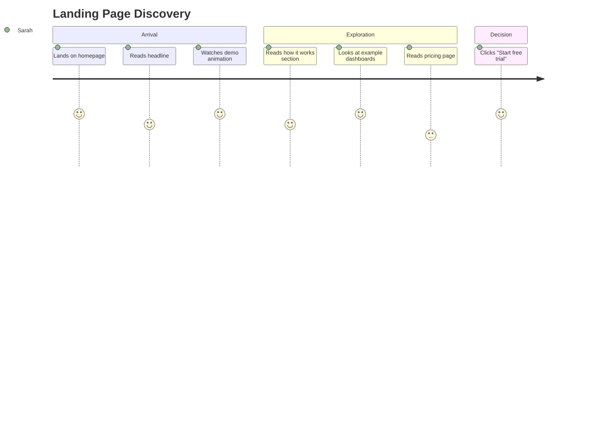
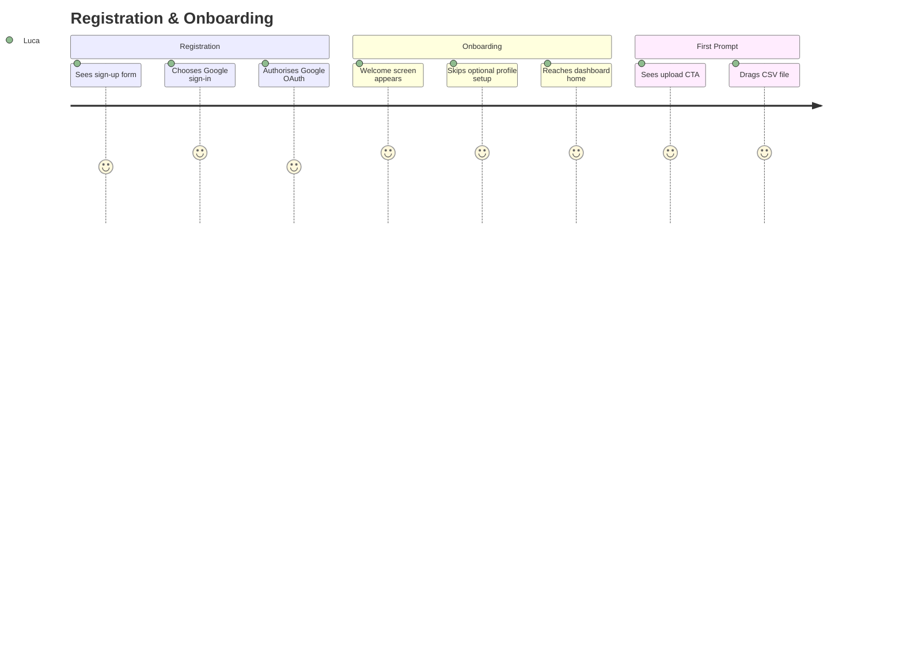
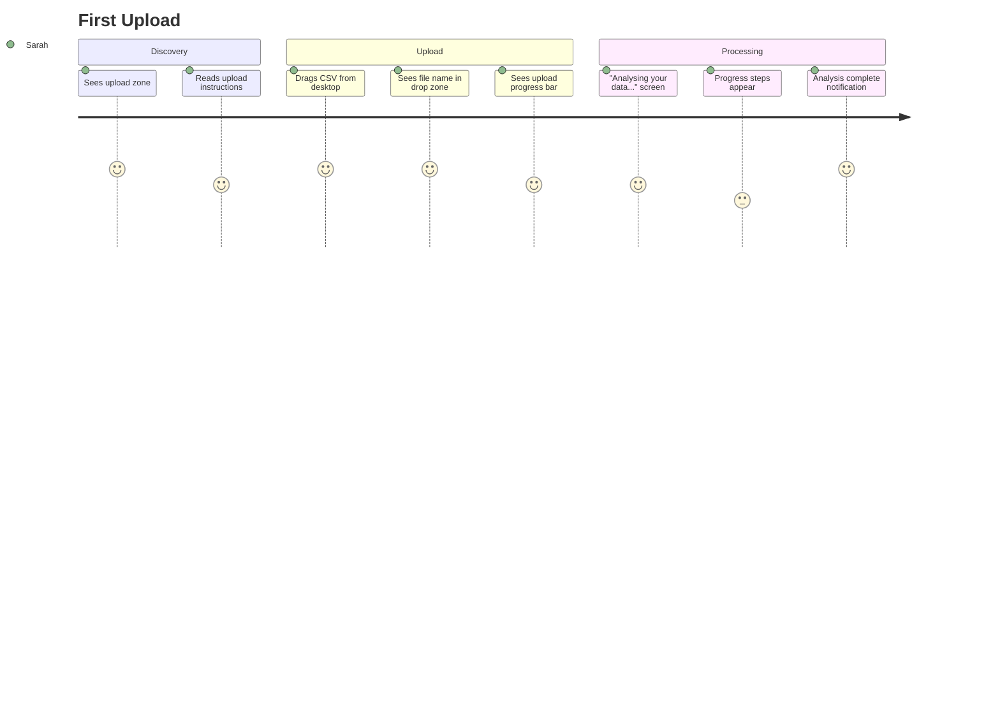
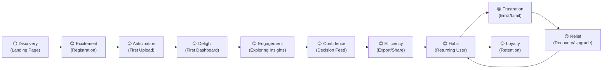

# 05 — User Journey

> **Document:** AI Dashboard Generator — User Journeys  
> **Version:** 1.0  
> **Last Updated:** 2026-06-25  
> **Status:** Approved  
> **Owner:** UX Design  
> **Related Documents:** [03_User_Personas.md](03_User_Personas.md), [04_User_Stories.md](04_User_Stories.md)

---

## Table of Contents

1. [Overview](#1-overview)
2. [Journey 1 — Landing Page Discovery](#2-journey-1--landing-page-discovery)
3. [Journey 2 — Registration & Onboarding](#3-journey-2--registration--onboarding)
4. [Journey 3 — First Upload](#4-journey-3--first-upload)
5. [Journey 4 — Analysing Results](#5-journey-4--analysing-results)
6. [Journey 5 — Working with the Dashboard](#6-journey-5--working-with-the-dashboard)
7. [Journey 6 — Decision Feed Engagement](#7-journey-6--decision-feed-engagement)
8. [Journey 7 — AI Chat Interaction](#8-journey-7--ai-chat-interaction)
9. [Journey 8 — Export & Sharing](#9-journey-8--export--sharing)
10. [Journey 9 — Returning User](#10-journey-9--returning-user)
11. [Journey 10 — Error Recovery](#11-journey-10--error-recovery)
12. [Journey 11 — Subscription Upgrade](#12-journey-11--subscription-upgrade)
13. [Journey 12 — Account Deletion](#13-journey-12--account-deletion)
14. [Journey 13 — Retention & Re-engagement](#14-journey-13--retention--re-engagement)
15. [Emotion Map Summary](#15-emotion-map-summary)

---

## 1. Overview

This document maps the complete user experience across 13 distinct journeys. Each journey includes:

- **Trigger** — What initiated the journey
- **Steps** — Detailed actions, thoughts, and system responses
- **Emotions** — User emotional state at each step
- **Drop-off Risks** — Where users are most likely to abandon
- **Design Imperatives** — UX requirements to optimise each step

### Journey Map Key

| Symbol | Meaning |
|--------|---------|
| 😊 | Positive emotion |
| 😐 | Neutral / uncertain |
| 😟 | Negative / frustrated |
| ⚠️ | Drop-off risk |
| ✅ | Design imperative met |
| ❌ | Design imperative failed / risk |

---

## 2. Journey 1 — Landing Page Discovery

**Primary Persona:** Sarah Chen (Small Business Owner)  
**Trigger:** Sarah sees an ad or organic search result for "automatic business dashboard from spreadsheet"  
**Goal:** Understand what the product does and decide whether to sign up

### Steps

| Step | User Action | System Response | Emotion | Risk |
|------|-------------|-----------------|---------|------|
| 1 | Arrives on homepage | Hero section loads < 2s | 😐 Cautious | ⚠️ Bounce if load > 3s |
| 2 | Reads headline | "Upload your data. Get your dashboard." visible immediately | 😊 Intrigued | — |
| 3 | Sees animated demo | 10-second animation showing upload → dashboard | 😊 Excited | — |
| 4 | Scrolls to "How it works" | 3-step visual: Upload → Analyse → Insight | 😊 Confident | — |
| 5 | Views example dashboards | Gallery of real-looking dashboards (retail, finance, operations) | 😊 Aspirational | — |
| 6 | Checks pricing | Free tier and Pro £29/month clear | 😐 Hesitant | ⚠️ Price shock if unclear |
| 7 | Looks for social proof | Testimonials and logos visible | 😊 Reassured | — |
| 8 | Clicks "Start free trial" | Redirected to registration | 😊 Motivated | — |

### Design Imperatives

- **Headline clarity:** The hero headline must communicate the value proposition in 8 words or fewer.
- **Instant demo:** An animated or interactive demo must be above the fold.
- **No free trial friction:** Free trial CTA must require no credit card; this must be stated explicitly on the CTA button.
- **Social proof:** At least 3 customer testimonials with real names, roles, and companies.
- **Pricing transparency:** Pricing must be accessible within 2 clicks from the homepage.

### Edge Cases

- User arrives via referral link with a pre-filled promo code → code auto-applied at registration.
- User is on mobile → mobile-optimised hero with vertical layout; demo adapts to portrait.
- Returning visitor who has not yet signed up → personalised CTA: "Continue your free trial."

---

## 3. Journey 2 — Registration & Onboarding

**Primary Persona:** Luca Moretti (Startup Founder)  
**Trigger:** Clicked "Start free trial" from landing page  
**Goal:** Create an account and reach the product's home screen

### Steps

| Step | User Action | System Response | Emotion | Risk |
|------|-------------|-----------------|---------|------|
| 1 | Arrives at registration page | Clean form: Email/Password or Google/Microsoft | 😊 Ready | — |
| 2 | Clicks "Continue with Google" | OAuth consent screen | 😊 Familiar | — |
| 3 | Authorises Google account | Account created; user redirected to onboarding | 😊 Smooth | ⚠️ OAuth failure = hard block |
| 4 | Sees welcome screen | "Welcome, Luca. Let's build your first dashboard." | 😊 Excited | — |
| 5 | Offered optional profile setup | Industry, company size (2 fields) | 😐 Mild friction | ⚠️ Drop-off if > 3 questions |
| 6 | Skips profile setup | Skipped; moved to dashboard home | 😊 Relieved | — |
| 7 | Sees dashboard home | Large upload zone with prompt: "Drop your first file here" | 😊 Clear CTA | — |
| 8 | Sees sample dashboard link | "Or explore a sample dashboard" | 😊 Option to preview | — |
| 9 | Tooltip highlights upload zone | First-time tour tooltip (dismissable) | 😊 Guided | ⚠️ Annoying if not dismissable |

### Onboarding Design Rules

- **Maximum 2 onboarding screens** before reaching the product.
- **Every screen must be skippable** — users who want to jump straight to uploading must be able to.
- **Progress indicator** visible: "Step 1 of 2."
- **Sample dashboard always available** as a zero-risk preview for hesitant users.
- **Welcome email** sent within 60 seconds with a link back to the product.

### Email Verification Handling

- Email verification required before upload.
- However: user can explore a **sample dashboard** before verifying.
- Upload blocked with a clear banner: "Please verify your email to upload your own data. [Resend verification email]."
- Verification not required for Google/Microsoft OAuth users (email already verified by provider).

---

## 4. Journey 3 — First Upload

**Primary Persona:** Sarah Chen (SMB Owner)  
**Trigger:** First login after registration; arrives at dashboard home  
**Goal:** Successfully upload a data file and trigger analysis

### Steps

| Step | User Action | System Response | Emotion | Risk |
|------|-------------|-----------------|---------|------|
| 1 | Arrives at home | Upload zone prominent; instructions clear | 😊 Confident | — |
| 2 | Drags CSV onto drop zone | Drop zone highlights; file name shown | 😊 Responsive | — |
| 3 | File uploaded | Progress bar: "Uploading... 2.1 MB / 3.4 MB" | 😐 Waiting | ⚠️ Anxiety if no progress |
| 4 | Upload completes | "Upload complete. Analysing your data..." | 😊 Anticipation | — |
| 5 | Analysis progress shown | Steps: "Reading data → Detecting patterns → Generating insights → Building dashboard" | 😊 Engaged | ⚠️ Frustration if > 15s |
| 6 | Dashboard appears | Full dashboard visible; Executive Summary loaded | 😊 Delighted | — |
| 7 | Optional: name the analysis | Inline edit appears; defaults to filename | 😊 Easy | — |

### Timing Expectations

| File Size | Expected Analysis Time | User Reaction if Exceeded |
|-----------|----------------------|--------------------------|
| < 1 MB | < 3 seconds | Happy |
| 1–5 MB | < 10 seconds | Satisfied |
| 5–20 MB | < 20 seconds | Acceptable if progress visible |
| 20–50 MB | < 45 seconds | Requires clear progress + estimated time |
| > 50 MB | < 90 seconds | Email notification acceptable |

### Error Scenarios

| Error | User Sees | Recovery Path |
|-------|-----------|---------------|
| File too large | "File is 52 MB. Your plan limit is 50 MB. Upgrade to Business for up to 500 MB." + Upgrade CTA | Upgrade or choose smaller file |
| Unsupported format | "PDF files are not supported. Please upload a CSV or Excel file." + format list | Upload correct file |
| Encoding error | "We detected characters that may not display correctly. Preview your data before proceeding." + preview | User confirms or re-exports |
| Network timeout | "Upload failed. Check your connection and try again." + Retry button | Retry |
| Analysis failure | "We couldn't analyse this file. [Specific reason]. Try [suggestion]." + support link | Fix file or contact support |

---

## 5. Journey 4 — Analysing Results

**Primary Persona:** Marcus Williams (CEO)  
**Trigger:** Analysis completes; Marcus sees the full dashboard for the first time  
**Goal:** Understand the key findings from his operational KPI data

### Steps

| Step | User Action | System Response | Emotion | Risk |
|------|-------------|-----------------|---------|------|
| 1 | Dashboard loads | Executive Summary tab shown by default | 😊 First impression | ⚠️ If empty/generic, trust lost |
| 2 | Reads Executive Summary | 4-paragraph narrative with specific numbers | 😊 Engaged | — |
| 3 | Clicks KPI Dashboard tab | 6 KPI cards with values, trends, sparklines | 😊 Comprehensive | — |
| 4 | Hovers over a KPI | Tooltip: exact value, % change, date range | 😊 Precise | — |
| 5 | Notices a red KPI (declining) | Anomaly badge on KPI card | 😟 Concerned (appropriately) | — |
| 6 | Clicks "Why is this declining?" | AI insight card expands with explanation | 😊 Informed | — |
| 7 | Navigates to Insights tab | 8 insight cards; most relevant first | 😊 Discovers unexpected finding | — |
| 8 | Reads anomaly insight | Clear language: "Revenue from Product Line C dropped 23% in March..." | 😊 Actionable | — |

### Executive Summary Quality Standards

The Executive Summary must:

1. Open with the single most important finding.
2. Reference at least 3 specific metrics by name and value.
3. Include at least one trend comparison (e.g., "compared to the previous period").
4. Close with a forward-looking statement (e.g., "At current trajectory, [metric] will [outcome] by [period]").
5. Be written in second person: "Your revenue..." not "The revenue..."
6. Be 300–500 words in length.
7. Use no more than one technical term (with inline explanation).

### Example Executive Summary Fragment

> "Your total revenue for Q1 2026 was £847,230, representing a 12% increase compared to Q4 2025. This growth was primarily driven by Product Line A, which contributed 64% of total revenue. However, Product Line C significantly underperformed, with revenue declining 23% month-on-month in March — an anomaly that warrants investigation. Based on current momentum, Q2 revenue is projected at £920,000–£960,000 (80% confidence interval). Your top priority this quarter is addressing the Product Line C decline before it impacts overall performance."

---

## 6. Journey 5 — Working with the Dashboard

**Primary Persona:** James O'Brien (Operations Manager)  
**Trigger:** Weekly production data uploaded; James reviews KPIs  
**Goal:** Identify any production KPIs in red and understand root causes

### Steps

| Step | User Action | System Response | Emotion | Risk |
|------|-------------|-----------------|---------|------|
| 1 | Opens dashboard | KPI dashboard default view | 😊 Familiar | — |
| 2 | Sees defect rate KPI in red | Red KPI card: "Defect Rate: 3.2% ↑ (Target: < 2%)" | 😟 Concerned | — |
| 3 | Applies filter: "Night Shift" | All charts update to night shift data | 😊 Investigative | — |
| 4 | Defect rate spikes to 5.1% for night shift | Night shift bars highlighted in anomaly detection chart | 😟 Identified issue | — |
| 5 | Applies additional filter: "Line 3" | Night shift + Line 3: defect rate = 6.8% | 😟 Root cause found | — |
| 6 | Reads AI insight on the filtered view | "Line 3 Night Shift defect rate is 6.8%, which is 3.4× the target and 2.1× the day shift rate for the same line." | 😊 Actionable | — |
| 7 | Opens Decision Feed | Recommendation: "Schedule maintenance inspection for Line 3 Night Shift." | 😊 Clear next step | — |
| 8 | Marks recommendation as actioned | Recommendation moves to "Completed" section | 😊 Closure | — |

### Dashboard Filter Design Rules

- Filters must apply to **all charts simultaneously** — not per-chart.
- Applied filters displayed as removable chips above the dashboard.
- Filter state must persist if the user navigates away and returns within the session.
- "Reset all filters" button always visible when filters are active.
- Filter values must be derived from actual column values — no manual entry required.

---

## 7. Journey 6 — Decision Feed Engagement

**Primary Persona:** Marcus Williams (CEO)  
**Trigger:** Marcus opens the Decision Feed tab to prepare for a leadership meeting  
**Goal:** Identify the 3 most important actions to discuss in the meeting

### Steps

| Step | User Action | System Response | Emotion | Risk |
|------|-------------|-----------------|---------|------|
| 1 | Opens Decision Feed | 5 prioritised recommendation cards | 😊 Structured | — |
| 2 | Reads top recommendation | "Reduce headcount in Fulfilment Centre 2: current staffing 34% above optimal for current order volume." | 😊 Specific | — |
| 3 | Expands "Why this recommendation?" | Data: order volume vs headcount comparison, £45K monthly overspend | 😊 Credible | — |
| 4 | Reads second recommendation | "Renegotiate Supplier A contract: current rates are 18% above market average for similar volumes." | 😊 Actionable | — |
| 5 | Dismisses a low-relevance recommendation | Recommendation hidden; "Hidden (1)" counter shown | 😊 Tidy | — |
| 6 | Exports Decision Feed as PDF | PDF section for Decision Feed generated | 😊 Ready for meeting | — |

### Decision Feed Quality Standards

Every recommendation must:

1. State a **specific action** (not a general observation).
2. Cite a **specific metric** and **specific value**.
3. State a **quantified expected impact** (monetary or percentage).
4. Be categorised: Revenue / Cost / Risk / Growth / Operations.
5. Be assigned a priority: High / Medium / Low.
6. Be free of hedging language: use "Reduce" not "Consider reducing."

---

## 8. Journey 7 — AI Chat Interaction

**Primary Persona:** Priya Sharma (Finance Manager)  
**Trigger:** Priya has received her analysis and wants to verify specific figures before sending to the CEO  
**Goal:** Ask targeted questions and confirm the accuracy of AI-generated figures

### Steps

| Step | User Action | System Response | Emotion | Risk |
|------|-------------|-----------------|---------|------|
| 1 | Opens chat panel | Chat panel slides in from right; input focused | 😊 Ready | — |
| 2 | Types: "What was gross margin in February?" | AI responds: "Gross margin in February was 42.3% (£123,450 gross profit on £292,000 revenue). Based on Revenue column and COGS column, rows 245–478." | 😊 Precise | — |
| 3 | Types: "How does that compare to January?" | AI responds: "January gross margin was 39.1%. February improved by 3.2 percentage points (+8.2%)." | 😊 Comparative | — |
| 4 | Sees follow-up suggestion chips | "Show me monthly gross margin trend", "What drove the improvement?", "Which products had the highest margin?" | 😊 Guided | — |
| 5 | Clicks "What drove the improvement?" | AI: "The improvement was primarily driven by [Product A], which increased from 38% to 47% margin, likely due to the pricing adjustment on 2026-01-28. This accounts for ~70% of the overall improvement." | 😊 Deep insight | — |
| 6 | Types: "Export this conversation" | AI: "You can export this chat session as a PDF using the Export button at the top of this panel." | 😊 Helpful | — |
| 7 | Copies a response to clipboard | Toast: "Copied to clipboard." | 😊 Efficient | — |

### Chat UX Design Rules

- Chat panel must **not cover the dashboard** — it must open as a side panel (≥ 992px viewport) or as a bottom drawer (mobile).
- The **data context must persist** — the AI knows which dataset is loaded without re-stating it.
- **Citations are non-negotiable** — every answer that involves a calculation must cite its source.
- **Streaming responses** — AI response should appear word-by-word (stream tokens) for a faster perceived experience.
- **Conversation memory within session** — the AI remembers previous questions in the same session.

---

## 9. Journey 8 — Export & Sharing

**Primary Persona:** Oliver Grant (Consultant)  
**Trigger:** Oliver has completed analysis of a client dataset and wants to share findings  
**Goal:** Export a professional PDF and share a link with the client

### Steps

| Step | User Action | System Response | Emotion | Risk |
|------|-------------|-----------------|---------|------|
| 1 | Clicks "Export" button | Export modal opens | 😊 Straightforward | — |
| 2 | Selects PDF format | PDF preview thumbnail shown; section selector available | 😊 Confident | — |
| 3 | Chooses sections: Summary, KPIs, Insights, Decision Feed | Selected sections highlighted | 😊 Controlled | — |
| 4 | Clicks "Generate PDF" | Progress indicator: "Generating your report..." | 😐 Waiting | ⚠️ Anxiety if > 10s |
| 5 | PDF ready (8 seconds) | Download starts; toast: "PDF downloaded." | 😊 Satisfied | — |
| 6 | Clicks "Share" | Share modal opens | 😊 Easy | — |
| 7 | Sets link expiry: 30 days | Options: 7d, 30d, Never | 😊 Appropriate | — |
| 8 | Adds password protection | Optional password field | 😊 Secure | — |
| 9 | Copies link | Toast: "Link copied to clipboard." | 😊 Done | — |
| 10 | Sends link to client by email | — (outside the product) | 😊 Delivered | — |
| 11 | Client opens link | Read-only dashboard; "Create account" CTA visible | Client: 😊 Impressed | — |

### Shared View Design Rules

- Shared views must be **visually polished** — the AI Dashboard Generator branding is present but subtle.
- No editing controls, no upload button, no account navigation.
- AI chat is **disabled** on shared links (data security; the recipient is not a verified user).
- A **"Create a free account"** CTA must be present — shared views are a distribution channel.
- Shared views must load in **< 2 seconds** (pre-rendered or cached).

---

## 10. Journey 9 — Returning User

**Primary Persona:** Daniel Kowalski (Sales Manager)  
**Trigger:** Monday morning; Daniel uploads this week's CRM pipeline export  
**Goal:** Review pipeline health in < 10 minutes before the weekly sales meeting

### Steps

| Step | User Action | System Response | Emotion | Risk |
|------|-------------|-----------------|---------|------|
| 1 | Logs in (session remembered) | Dashboard home — recent analyses list | 😊 Efficient | — |
| 2 | Sees last week's analysis | Recent analysis tile with date and summary | 😊 Context | — |
| 3 | Drags new CSV onto drop zone | Upload begins; "Analysing Pipeline_W26.csv..." | 😊 Routine | — |
| 4 | Analysis completes (7 seconds) | New dashboard loads | 😊 Fast | — |
| 5 | Compares to last week | "Compare to previous" button on KPI cards | 😊 Trend visible | ⚠️ If comparison not automatic |
| 6 | Sees pipeline coverage down from 4.2× to 3.6× | Red KPI card; anomaly flagged | 😟 Action required | — |
| 7 | Decision Feed: "Pipeline coverage is below 3× threshold. Add 12 new opportunities to reach target." | Specific and quantified | 😊 Clear action | — |
| 8 | Exports summary as PDF | 1-click re-export | 😊 Ready for meeting | — |

### Returning User Design Rules

- **Recent analyses always visible** on the home screen (last 5).
- **Week-on-week comparison** automatically offered when same-schema file is uploaded again.
- **"Re-upload" flow** (replacing an existing analysis) is one step, not a full new upload flow.
- Returning users should reach their most recent analysis in **< 3 clicks from login**.

---

## 11. Journey 10 — Error Recovery

**Primary Persona:** Rachel Thompson (HR Manager)  
**Trigger:** Rachel uploads an HR CSV from BambooHR; the analysis fails  
**Goal:** Understand what went wrong and successfully re-upload

### Steps

| Step | User Action | System Response | Emotion | Risk |
|------|-------------|-----------------|---------|------|
| 1 | Uploads CSV | Upload progress bar appears | 😊 Hopeful | — |
| 2 | Upload succeeds; analysis begins | "Analysing your data..." | 😊 Anticipating | — |
| 3 | Analysis fails after 12 seconds | Error screen: "We couldn't analyse this file." | 😟 Frustrated | ⚠️ Trust loss |
| 4 | Error message reads | "Your file appears to contain merged cells and inconsistent column headers. This prevents automated analysis." | 😐 Understanding | — |
| 5 | Sees actionable suggestions | "1. Open in Excel and un-merge cells. 2. Ensure row 1 contains column headers. 3. Save as CSV and re-upload." | 😊 Guided | — |
| 6 | "Download diagnostic report" option shown | CSV listing specific rows with issues | 😊 Specific help | — |
| 7 | Fixes file in Excel (5 minutes) | — | 😐 Mild friction | — |
| 8 | Re-uploads fixed file | Analysis succeeds | 😊 Relief | — |

### Error Recovery Design Rules

- **Never show a generic error message.** Every error must state: what went wrong, why, and what to do about it.
- **Provide a diagnostic download** for structural file errors.
- **Offer to contact support** on every error screen — with the error context pre-filled.
- **Success rate goal:** 92% of users who see an error screen successfully recover and complete analysis (see [02_Product_Requirements.md §15](02_Product_Requirements.md)).
- **Error messages must be non-technical:** No stack traces, no error codes visible to users.

### Common Error Scenarios & Responses

| Error Type | User-Facing Message | Recovery Action |
|-----------|---------------------|----------------|
| File too large | "This file (X MB) exceeds your Y MB limit. Upgrade to [Plan] to upload larger files." | Upgrade CTA |
| All columns empty | "Your file appears to be empty. Please check the file and re-upload." | Re-upload |
| No numeric data | "This file contains only text — no numeric data to analyse. Upload a file with sales figures, quantities, or financial data." | Example link |
| Date parse failure | "We couldn't read dates in the [Column] column. Please ensure dates are formatted consistently (e.g., DD/MM/YYYY)." | Format guide |
| Analysis timeout | "Analysis is taking longer than expected. We'll email you when it's ready." | Email notification |
| Network error | "Upload interrupted. Check your connection and try again." | Retry button |

---

## 12. Journey 11 — Subscription Upgrade

**Primary Persona:** Sarah Chen (SMB Owner)  
**Trigger:** Sarah has used all 5 of her Free plan uploads and wants to upload a new file  
**Goal:** Upgrade to Pro plan with minimal friction

### Steps

| Step | User Action | System Response | Emotion | Risk |
|------|-------------|-----------------|---------|------|
| 1 | Attempts to upload 6th file | Block screen appears | 😟 Blocked | ⚠️ Frustration |
| 2 | Sees usage message | "You've used all 5 free analyses this month (resets 2026-07-01)." | 😐 Informed | — |
| 3 | Reads upgrade CTA | "Upgrade to Pro: 50 analyses/month for £29." + feature comparison | 😐 Considering | — |
| 4 | Sees "What you'll get" | Checklist: 50 analyses, 50 MB files, forecasting, PDF export, shareable links | 😊 Value clear | — |
| 5 | Clicks "Upgrade to Pro" | Stripe Checkout opens | 😊 Committed | — |
| 6 | Enters card details | Stripe hosted form; card previewed | 😐 Trust step | ⚠️ Checkout abandonment |
| 7 | Confirms payment | "Payment confirmed. Welcome to Pro!" | 😊 Delighted | — |
| 8 | Redirect to dashboard | Original upload resumes automatically | 😊 Seamless | — |
| 9 | Upload completes; dashboard appears | "Pro plan active. 49 analyses remaining this month." | 😊 Satisfied | — |

### Upgrade Flow Design Rules

- **Zero steps between "block screen" and "checkout."** No landing page, no feature comparison page (unless user clicks "Learn more").
- **Resume interrupted action automatically** after upgrade — do not make the user re-start the upload.
- **Show social proof in checkout flow:** "Thousands of businesses use AI Dashboard Generator."
- **Annual plan option visible** in checkout: "Switch to annual and save 20% — £278/year."
- **Confirmation email** sent within 60 seconds of payment.

---

## 13. Journey 12 — Account Deletion

**Primary Persona:** Any user exercising GDPR rights  
**Trigger:** User decides to leave the platform  
**Goal:** Delete account and all data permanently

### Steps

| Step | User Action | System Response | Emotion | Risk |
|------|-------------|-----------------|---------|------|
| 1 | Navigates to Settings → Account | Account settings page | 😐 Decided | — |
| 2 | Clicks "Delete Account" | Confirmation modal appears | 😐 Deliberate | — |
| 3 | Reads data deletion policy | "All your analyses, files, and personal data will be deleted within 30 days." | 😊 Informed | — |
| 4 | Optional exit survey | "Why are you leaving?" (optional, skippable) | 😐 Neutral | — |
| 5 | Types "DELETE" to confirm | Confirmation input | 😐 Intentional | — |
| 6 | Account deletion requested | "Your account deletion has been scheduled. You'll receive a confirmation email." | 😐 Done | — |
| 7 | Receives confirmation email | "Account deletion scheduled. Access ends in 30 days." | 😐 Closed | — |
| 8 | Data purged at 30 days | No user action required | — | — |

### Deletion Design Rules

- **Never make deletion difficult to find** — this is a legal obligation under GDPR.
- **No dark patterns:** No "Are you sure you don't want to stay?" guilt-trip language.
- **Offer downgrade as an alternative** to deletion — but as a single informational option, not a barrier.
- **30-day purge** for all data (not immediate, to allow recovery requests).
- **Data portability export** offered before deletion confirmation.

---

## 14. Journey 13 — Retention & Re-engagement

**Primary Persona:** Kezia Adeyemi (Marketing Manager)  
**Trigger:** Kezia has not logged in for 14 days  
**Goal:** Re-engage Kezia and remind her of the value she experienced

### Re-engagement Touchpoints

| Day | Channel | Message | Goal |
|-----|---------|---------|------|
| Day 7 (no login) | Email | "Your last analysis had 3 key insights — here's a reminder." | Bring back to app |
| Day 14 (no login) | Email | "Your [month] report is waiting. New data to upload?" | Create urgency |
| Day 21 (trial expiring) | Email | "Your Pro trial ends in 3 days. Upgrade to keep your dashboards." | Convert to paid |
| Day 30 (churned) | Email | "We miss you. 5 new features since you left." | Re-activate |

### In-App Retention Touchpoints

| Trigger | In-App Prompt | Goal |
|---------|--------------|------|
| First login after 7-day gap | "Welcome back! You have new data to analyse." | Reduce friction to re-upload |
| 50% of monthly quota used | "You've used 25 of your 50 monthly analyses." | Awareness (not alarm) |
| 3 consecutive months of use | "You've been using AI Dashboard Generator for 3 months. Here's what you've discovered." | Delight and reinforce habit |

### Retention Design Rules

- **Re-engagement emails must reference specific past analyses** — not generic product messaging.
- **Every email must have a single, unambiguous CTA** — no multiple links competing for clicks.
- **Unsubscribe from non-essential emails** must be available in one click.
- **Never send more than 2 re-engagement emails per week** per user.
- **Personalisation minimum:** user's first name + name of their last analysis.

---

## 15. Emotion Map Summary

This emotion map summarises the user's emotional state across the complete lifecycle — from discovery to retention.

### Critical Moments of Truth

| Moment | Emotion Target | Risk if Failed |
|--------|---------------|----------------|
| First dashboard renders | 😊 Delight | User churns immediately |
| Executive Summary quality | 😊 Trust | User never uploads again |
| Error recovery | 😊 Supported | User leaves and never returns |
| Upgrade block screen | 😊 Motivated (not frustrated) | Conversion fails |
| Shared link received by client | 😊 Impressed | Word-of-mouth lost |
