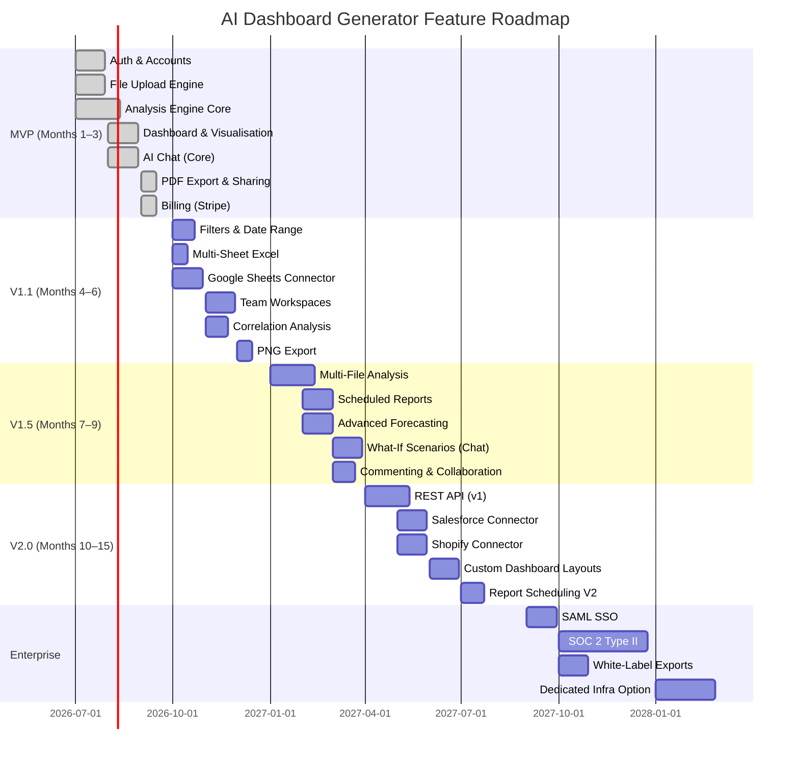

# 06 — Feature Roadmap

> **Document:** AI Dashboard Generator — Feature Roadmap  
> **Version:** 1.0  
> **Last Updated:** 2026-06-25  
> **Status:** Approved  
> **Owner:** Product Management  
> **Related Documents:** [02_Product_Requirements.md](02_Product_Requirements.md), [04_User_Stories.md](04_User_Stories.md), [07_Competitive_Analysis.md](07_Competitive_Analysis.md)

---

## Table of Contents

1. [Overview & Prioritisation Framework](#1-overview--prioritisation-framework)
2. [MVP — Foundation (Month 1–3)](#2-mvp--foundation-month-13)
3. [Version 1.1 — Growth (Month 4–6)](#3-version-11--growth-month-46)
4. [Version 1.5 — Advanced Intelligence (Month 7–9)](#4-version-15--advanced-intelligence-month-79)
5. [Version 2.0 — Platform (Month 10–15)](#5-version-20--platform-month-1015)
6. [Enterprise Tier](#6-enterprise-tier)
7. [AI Features Roadmap](#7-ai-features-roadmap)
8. [Future Research](#8-future-research)
9. [Roadmap Visualisation](#9-roadmap-visualisation)
10. [Prioritisation Decisions Log](#10-prioritisation-decisions-log)

---

## 1. Overview & Prioritisation Framework

### 1.1 MoSCoW Priority Definitions

| Priority | Label | Definition |
|----------|-------|-----------|
| **P0** | Must Have | Without this, the product cannot launch. Core value proposition. |
| **P1** | Should Have | Important; significantly improves experience. Missed if absent. |
| **P2** | Could Have | Desirable; adds value but product remains viable without it. |
| **P3** | Won't Have Yet | Explicitly deferred. Not in current scope. |

### 1.2 Feature Scoring Criteria

Each feature is scored on three dimensions (1–5 each), then ranked:

| Dimension | Description |
|-----------|-------------|
| **Impact** | Business value delivered to the user |
| **Confidence** | Certainty that users want this feature |
| **Effort** | Inverse of engineering complexity (5 = low effort, 1 = very high effort) |

**Priority Score** = Impact × Confidence × Effort

### 1.3 Versioning Philosophy

| Release | Purpose | Duration |
|---------|---------|----------|
| **MVP** | Prove core value proposition; reach product-market fit signal | Weeks 1–12 |
| **V1.1** | Address most painful gaps post-MVP; grow DAU | Weeks 13–24 |
| **V1.5** | Deepen AI capabilities; justify Pro plan upgrade | Weeks 25–36 |
| **V2.0** | Platform expansion; API; integrations; enterprise readiness | Weeks 37–52 |
| **Enterprise** | Compliance, SSO, white-label, dedicated infra | Month 13+ |

---

## 2. MVP — Foundation (Month 1–3)

> **Goal:** Ship a product that delivers the core promise — upload data, receive a complete AI-powered analysis — reliably, quickly, and beautifully.

### 2.1 Authentication & Accounts

| Feature | Priority | Story Ref | Notes |
|---------|----------|-----------|-------|
| Email/password registration | P0 — Must Have | US-AUTH-01 | Core access |
| Google OAuth | P0 — Must Have | US-AUTH-02 | Reduces sign-up friction significantly |
| Email verification | P0 — Must Have | US-AUTH-04 | Required for GDPR and deliverability |
| Password reset via email | P0 — Must Have | US-AUTH-07 | Standard requirement |
| Session management (30-day remember me) | P1 — Should Have | US-AUTH-06 | Improves retention |
| Account lockout after failed attempts | P0 — Must Have | US-AUTH-11 | Security requirement |
| Account deletion (GDPR) | P0 — Must Have | US-AUTH-12 | Legal requirement |

### 2.2 File Upload

| Feature | Priority | Story Ref | Notes |
|---------|----------|-----------|-------|
| Drag-and-drop upload zone | P0 — Must Have | US-UP-01 | Primary upload mechanic |
| File picker button | P0 — Must Have | US-UP-02 | Fallback for drag-and-drop |
| Real-time upload progress | P0 — Must Have | US-UP-03 | Trust during upload |
| File size validation (plan limit) | P0 — Must Have | US-UP-04 | Plan enforcement |
| File type validation | P0 — Must Have | US-UP-05 | Prevent processing failures |
| CSV auto-delimiter detection | P0 — Must Have | US-UP-16 | Core parsing requirement |
| Encoding auto-detection (UTF-8, Latin-1) | P0 — Must Have | US-UP-08 | Data integrity |
| Data quality report on upload | P0 — Must Have | US-UP-11 | Trust signal |
| Upload history list | P0 — Must Have | US-UP-13 | Navigation requirement |
| Delete analysis | P0 — Must Have | US-UP-14 | GDPR + quota management |
| Privacy statement on upload screen | P0 — Must Have | US-UP-19 | Trust signal; legal |

### 2.3 Analysis Engine (Core)

| Feature | Priority | Story Ref | Notes |
|---------|----------|-----------|-------|
| Auto column type detection | P0 — Must Have | FR-PROC-01 | Foundation of all analysis |
| Data quality scoring | P0 — Must Have | FR-PROC-11 | Trust signal |
| Auto KPI identification (≥ 3) | P0 — Must Have | FR-PROC-03 | Core value proposition |
| AI-generated Executive Summary | P0 — Must Have | FR-PROC-05 | Flagship feature |
| AI insight generation (≥ 5 insights) | P0 — Must Have | FR-PROC-04 | Core value proposition |
| Anomaly detection | P0 — Must Have | FR-PROC-06 | High-value differentiator |
| Time-series forecasting | P0 — Must Have | FR-PROC-08 | Differentiates vs spreadsheets |
| Decision Feed / Recommendations (≥ 3) | P0 — Must Have | FR-PROC-09 | Core differentiator |
| Analysis completion ≤ 10s for ≤ 5 MB | P0 — Must Have | FR-PROC-10 | Core performance requirement |
| CSV and XLSX support | P0 — Must Have | FR-UP-05 | Minimum file format support |
| XLS (legacy Excel) support | P1 — Should Have | §10 | Common format |

### 2.4 Dashboard & Visualisation

| Feature | Priority | Story Ref | Notes |
|---------|----------|-----------|-------|
| KPI dashboard with trend cards | P0 — Must Have | US-DASH-01 | Core UI feature |
| Executive Summary tab | P0 — Must Have | US-DASH-02 | Flagship output |
| Insights tab | P0 — Must Have | US-DASH-04 | Core value |
| Decision Feed tab | P0 — Must Have | FR-DASH-05 | Core differentiator |
| Forecasts tab | P0 — Must Have | FR-DASH-06 | High-value feature |
| Auto chart type selection | P0 — Must Have | US-DASH-04 | Core AI capability |
| Chart hover tooltips | P0 — Must Have | US-DASH-13 | Basic interactivity |
| Dashboard loading state | P0 — Must Have | US-DASH-14 | Trust during processing |
| Confidence scores on AI content | P0 — Must Have | US-DASH-15 | Trust signal |
| Currency auto-detection & formatting | P0 — Must Have | US-DASH-19 | Professional output |
| Trend arrows on KPI cards | P0 — Must Have | US-DASH-21 | Core KPI affordance |
| Empty/error states | P0 — Must Have | US-DASH-22 | Error handling |
| Dashboard URL persistence | P0 — Must Have | US-DASH-09 | Navigation |
| Data quality warnings on dashboard | P0 — Must Have | US-DASH-10 | Trust |

### 2.5 AI Chat

| Feature | Priority | Story Ref | Notes |
|---------|----------|-----------|-------|
| Natural language questions | P0 — Must Have | US-CHAT-01 | Core AI chat feature |
| Chart generation in chat | P0 — Must Have | US-CHAT-04 | Enhances responses |
| Data citations on answers | P0 — Must Have | US-CHAT-03 | Trust / accuracy |
| Confidence indicator on responses | P0 — Must Have | US-CHAT-11 | Trust |
| Ambiguity handling | P0 — Must Have | US-CHAT-06 | Accuracy |
| Out-of-data-scope handling | P0 — Must Have | US-CHAT-09 | Safety |
| Chat response ≤ 6s (p95) | P0 — Must Have | US-CHAT-10 | Performance |
| Chat history persistence | P0 — Must Have | US-CHAT-07 | UX continuity |

### 2.6 Export

| Feature | Priority | Story Ref | Notes |
|---------|----------|-----------|-------|
| PDF export (full dashboard) | P0 — Must Have | US-EXP-01 | Core export feature |
| CSV export (clean data) | P0 — Must Have | US-EXP-05 | Data portability |
| Shareable read-only link | P0 — Must Have | US-EXP-02 | Distribution & viral loop |
| Share link revocation | P0 — Must Have | US-EXP-08 | Security |

### 2.7 Billing

| Feature | Priority | Story Ref | Notes |
|---------|----------|-----------|-------|
| 14-day free trial (no card) | P0 — Must Have | US-BILL-01 | Acquisition strategy |
| Stripe payment integration | P0 — Must Have | US-BILL-02 | Monetisation |
| Plan limit enforcement | P0 — Must Have | FR-BILL-02 | Business logic |
| Email receipts | P0 — Must Have | US-BILL-03 | Legal / trust |
| Subscription cancellation | P0 — Must Have | US-BILL-08 | Legal |
| Upgrade flow in-app | P0 — Must Have | US-BILL-06 | Monetisation |
| Failed payment handling | P0 — Must Have | US-BILL-10 | Revenue protection |
| Usage overview in settings | P0 — Must Have | US-BILL-15 | Transparency |

### 2.8 MVP Acceptance Criteria

The MVP is shippable when:

- [ ] End-to-end: upload CSV → dashboard visible in < 10s (p95) for ≤ 5 MB files.
- [ ] Executive Summary generated for 100% of analyses with numeric data.
- [ ] Minimum 5 insights generated per analysis (Pro plan).
- [ ] Minimum 3 recommendations in Decision Feed.
- [ ] AI chat responds correctly to direct metric questions with data citations.
- [ ] PDF export produces a complete, professionally formatted report.
- [ ] Shareable link works for unauthenticated recipients.
- [ ] All P0 security requirements from [02_Product_Requirements.md §6](02_Product_Requirements.md) met.
- [ ] WCAG 2.1 AA automated scan: 0 violations.
- [ ] Zero critical CVEs in dependency scan.

---

## 3. Version 1.1 — Growth (Month 4–6)

> **Goal:** Address the highest-impact gaps identified from MVP user feedback. Improve activation and W4 retention.

### 3.1 Upload Enhancements

| Feature | Priority | Story Ref | Rationale |
|---------|----------|-----------|-----------|
| Multi-sheet Excel — sheet selector | P1 — Should Have | US-UP-07 | Very common Excel pattern |
| Data preview before analysis | P1 — Should Have | US-UP-10 | Builds trust; reduces error rate |
| Custom analysis name on upload | P1 — Should Have | US-UP-06 | Organisation for power users |
| Duplicate upload detection | P1 — Should Have | US-UP-09 | Prevent wasted quota |
| ZIP archive upload support | P2 — Could Have | US-UP-18 | Convenience |
| Google Sheets import | P1 — Should Have | §13 | High-demand connector |

### 3.2 Dashboard Enhancements

| Feature | Priority | Story Ref | Rationale |
|---------|----------|-----------|-----------|
| Categorical dimension filters | P1 — Should Have | US-DASH-06 | Essential for segment analysis |
| Date range filter | P1 — Should Have | US-DASH-07 | Essential for time-based data |
| Chart type switcher | P1 — Should Have | US-DASH-05 | Power user feature |
| Dashboard rename | P1 — Should Have | US-DASH-08 | Organisation |
| Raw data table tab | P1 — Should Have | US-DASH-20 | Trust / verification |
| Period comparison on KPI cards | P1 — Should Have | US-DASH-16 | High-value insight |
| Mobile responsive layout | P1 — Should Have | US-DASH-17 | Growing mobile usage |

### 3.3 Insight Enhancements

| Feature | Priority | Story Ref | Rationale |
|---------|----------|-----------|-----------|
| Correlation analysis insights | P1 — Should Have | US-INS-05 | Differentiating AI capability |
| Insight categorisation (Trend, Anomaly, etc.) | P1 — Should Have | US-INS-11 | Navigation & filtering |
| Seasonal pattern detection | P1 — Should Have | US-INS-14 | High-value for retail/marketing |
| Insight dismissal | P2 — Could Have | US-INS-07 | UX cleanliness |

### 3.4 Forecasting Enhancements

| Feature | Priority | Story Ref | Rationale |
|---------|----------|-----------|-----------|
| Forecast horizon selector (1/3/6/12 periods) | P1 — Should Have | US-FOR-06 | User control |
| Multiple metrics side by side | P1 — Should Have | US-FOR-07 | Comprehensive view |
| Seasonal adjustment in forecasts | P1 — Should Have | US-FOR-08 | Accuracy improvement |
| Forecast CSV export | P1 — Should Have | US-FOR-10 | Finance use case |

### 3.5 Team & Collaboration (V1.1)

| Feature | Priority | Story Ref | Rationale |
|---------|----------|-----------|-----------|
| Workspace concept (shared library) | P1 — Should Have | US-COL-01 | Enables Business plan upsell |
| Invite team members by email | P1 — Should Have | US-ADM-02 | Multi-user requirement |
| Role-based permissions (Admin/Analyst/Viewer) | P1 — Should Have | §11 | Access control |
| Share analysis with workspace members | P1 — Should Have | US-COL-02 | Collaboration core |
| Workspace member management | P1 — Should Have | US-ADM-01 | Admin requirement |

### 3.6 Export Enhancements

| Feature | Priority | Story Ref | Rationale |
|---------|----------|-----------|-----------|
| PNG export per chart | P1 — Should Have | US-EXP-04 | Presentation use case |
| Section selector in PDF export | P1 — Should Have | US-REP-03 | Customisation |
| Share link view count | P2 — Could Have | US-EXP-07 | Consultant use case |
| Report history | P1 — Should Have | US-REP-10 | Power user convenience |

---

## 4. Version 1.5 — Advanced Intelligence (Month 7–9)

> **Goal:** Deepen AI analytical capability. Justify the Pro plan value at scale and begin differentiating from emerging competitors.

### 4.1 Multi-File Analysis

| Feature | Priority | Rationale |
|---------|----------|-----------|
| Upload two related datasets and auto-join | P1 — Should Have | Enables cross-dataset insights (e.g., Salesforce + Shopify) |
| AI-identified join key suggestion | P1 — Should Have | Makes join accessible to non-technical users |
| Cross-dataset correlation analysis | P1 — Should Have | Powerful differentiator |

### 4.2 Advanced AI Insights

| Feature | Priority | Rationale |
|---------|----------|-----------|
| Causal inference (experimental) | P2 — Could Have | Differentiating AI capability; high engineering effort |
| What-if scenario modelling in chat | P1 — Should Have | "What if I increase prices by 10%?" |
| Root cause attribution | P1 — Should Have | Beyond correlation — suggests why something changed |
| Benchmark suggestions (industry context) | P2 — Could Have | "Your gross margin is below the retail industry average of 42%" |

### 4.3 Scheduled Reports

| Feature | Priority | Story Ref | Rationale |
|---------|----------|-----------|-----------|
| Schedule recurring analysis from same file source | P1 — Should Have | US-REP-08 | Retention driver for regular users |
| Automated email report delivery | P1 — Should Have | US-REP-08 | Passive value delivery |
| Google Sheets live sync | P1 — Should Have | §13 | Keeps analysis current |

### 4.4 Enhanced Export

| Feature | Priority | Story Ref | Rationale |
|---------|----------|-----------|-----------|
| Word (.docx) export of Executive Summary | P2 — Could Have | US-REP-06 | Consultant use case |
| Decision Feed CSV export (task list) | P2 — Could Have | US-REP-09 | PM / operations use case |
| Chat session PDF export | P2 — Could Have | US-EXP-09 | Audit trail use case |

### 4.5 Collaboration (V1.5)

| Feature | Priority | Story Ref | Rationale |
|---------|----------|-----------|-----------|
| Comments on insight cards | P1 — Should Have | US-COL-04 | Team discussion |
| Analysis tagging | P2 — Could Have | US-COL-08 | Organisation at scale |
| Starred/favourited analyses | P2 — Could Have | US-COL-09 | Power user convenience |
| Workspace activity feed | P2 — Could Have | US-COL-11 | Team awareness |

### 4.6 Performance & Reliability

| Feature | Priority | Rationale |
|---------|----------|-----------|
| Analysis job queue with status tracking | P1 — Should Have | Handle peak load; user visibility |
| Streaming progress for large file analysis | P1 — Should Have | UX for 20–500 MB files |
| Analysis versioning (history) | P1 — Should Have | Re-upload comparison |

---

## 5. Version 2.0 — Platform (Month 10–15)

> **Goal:** Open the platform to programmatic access. Connect to live data sources. Begin enterprise readiness.

### 5.1 REST API

| Feature | Priority | Rationale |
|---------|----------|-----------|
| API key management | P1 — Should Have | Foundation for all API features |
| POST /analyses — programmatic upload and trigger | P1 — Should Have | Automation use case |
| GET /analyses/{id}/insights — retrieve insights | P1 — Should Have | Integration with downstream tools |
| GET /analyses/{id}/forecasts | P1 — Should Have | Embed forecasts in other systems |
| Webhook on analysis completion | P1 — Should Have | Event-driven integrations |
| OpenAPI 3.0 specification published | P1 — Should Have | Developer experience |

### 5.2 Native Integrations

| Integration | Priority | Rationale |
|------------|----------|-----------|
| Salesforce (CRM export) | P1 — Should Have | Very common data source for sales teams |
| Shopify (eCommerce data) | P1 — Should Have | SMB eCommerce use case |
| QuickBooks (accounting) | P1 — Should Have | SMB finance use case |
| Google Analytics 4 | P1 — Should Have | Marketing use case |
| HubSpot (CRM/marketing) | P2 — Could Have | Mid-market marketing |
| Stripe (revenue data) | P2 — Could Have | SaaS/startup use case |
| Xero (accounting) | P2 — Could Have | UK/AU market |
| Airtable | P2 — Could Have | Operations teams |

### 5.3 Advanced Visualisation

| Feature | Priority | Rationale |
|---------|----------|-----------|
| Heatmap chart type | P1 — Should Have | Operations use case (hourly/weekly patterns) |
| Cohort retention chart | P1 — Should Have | SaaS/product use case |
| Funnel chart | P2 — Could Have | Sales and marketing use case |
| Custom dashboard layout (drag-and-drop) | P2 — Could Have | Power user customisation; must remain optional |
| Dark mode | P2 — Could Have | User preference |

### 5.4 Reporting

| Feature | Priority | Rationale |
|---------|----------|-----------|
| Branded report templates | P1 — Should Have | Consultant use case |
| Report scheduling (full V2) | P1 — Should Have | Builds habit loop |
| Email digest (weekly summary) | P2 — Could Have | Retention driver |

---

## 6. Enterprise Tier

> **Target:** Organisations with 50+ users, compliance requirements, and integration needs. Sold via a sales-assisted motion.

### 6.1 Security & Compliance

| Feature | Priority | Rationale |
|---------|----------|-----------|
| SAML 2.0 SSO (Okta, Azure AD, Google Workspace) | P0 — Must Have | Enterprise security requirement |
| SCIM user provisioning | P1 — Should Have | IT automation |
| SOC 2 Type II certification | P1 — Should Have | Enterprise procurement requirement |
| Audit logs (full event history) | P0 — Must Have | Compliance & security |
| Data residency options (EU, US) | P1 — Should Have | GDPR and data sovereignty |
| IP allowlisting | P1 — Should Have | Network security |
| Custom data retention policies | P1 — Should Have | Compliance |

### 6.2 White-Label & Embedded Analytics

| Feature | Priority | Rationale |
|---------|----------|-----------|
| Custom branding on exports (logo, colours) | P1 — Should Have | Agency/consultant use case |
| Embeddable dashboard iframe | P1 — Should Have | Product analytics embedding |
| White-label portal (custom domain) | P2 — Could Have | Reseller/agency use case |
| Custom AI report templates | P2 — Could Have | Vertical-specific output |

### 6.3 Scale & Infrastructure

| Feature | Priority | Rationale |
|---------|----------|-----------|
| Dedicated infrastructure option | P1 — Should Have | Large enterprise with data isolation needs |
| File size up to 5 GB | P1 — Should Have | Enterprise data volumes |
| Row limit up to 10M rows | P1 — Should Have | Enterprise datasets |
| SLA: 99.95% uptime | P1 — Should Have | Enterprise requirement |
| Dedicated customer success manager | P0 — Must Have | Retention for high-ACV accounts |

### 6.4 Collaboration

| Feature | Priority | Rationale |
|---------|----------|-----------|
| Unlimited workspace members | P0 — Must Have | Enterprise team size |
| Department/group access controls | P1 — Should Have | Org structure compliance |
| Approval workflows for shared analyses | P2 — Could Have | Regulated industries |

---

## 7. AI Features Roadmap

AI capabilities are tracked separately due to their distinct development and research requirements.

### 7.1 AI Capabilities by Version

| Version | AI Capability |
|---------|--------------|
| MVP | Column type detection, KPI identification, anomaly detection (IQR/Z-score), NLG executive summary, NLG insights, time-series forecasting (exponential smoothing), NLU chat (RAG over uploaded data), recommendation generation |
| V1.1 | Correlation analysis, seasonal decomposition, domain classification (Sales/Finance/HR/etc.) |
| V1.5 | Multi-dataset join suggestion, root cause attribution, what-if scenario modelling, causal inference (experimental) |
| V2.0 | Predictive churn modelling, price sensitivity analysis, competitive benchmarking (external data) |
| Enterprise | Fine-tuned models for specific verticals, on-premise model deployment option |

### 7.2 AI Quality Standards

All AI features must meet the following standards before release:

| Standard | Requirement |
|----------|-------------|
| Accuracy (KPI identification) | ≥ 95% correct identification in test suite of 200 datasets |
| Accuracy (Executive Summary relevance) | ≥ 90% rated "relevant" in blind review |
| Accuracy (Anomaly detection) | < 10% false positive rate; < 15% false negative rate |
| Forecast accuracy (MAPE) | < 15% MAPE on 30-day horizon for seasonal retail datasets |
| Chat accuracy (factual questions) | ≥ 98% factually correct answers with no hallucinated figures |
| Hallucination rate | 0% tolerance for fabricated figures that don't exist in the dataset |

### 7.3 AI Safety Guardrails

| Guardrail | Implementation |
|-----------|---------------|
| No training on user data | All LLM calls use API-only; no fine-tuning on user uploads |
| Prompt injection prevention | Input sanitisation; system prompt protection; user content treated as untrusted |
| Hallucination mitigation | All numeric claims grounded to source data; confidence scoring; explicit uncertainty expression |
| PII detection | PII scanning before data is sent to LLM API; redaction if PII detected and user not warned |
| Output filtering | All LLM outputs reviewed by a secondary safety classifier before display |

---

## 8. Future Research

The following items are **not on the current roadmap** but represent areas of active research and future investment.

| Item | Description | Horizon |
|------|-------------|---------|
| **Streaming data connectors** | Real-time analysis of live data streams (Kafka, Kinesis) | Year 3 |
| **Predictive modelling studio** | No-code interface to train regression/classification models on uploaded data | Year 3 |
| **AI agent marketplace** | Community-contributed analysis agents (e.g., "Retail Performance Agent") | Year 3 |
| **Voice-driven analysis** | Speak a question; receive an audio response with chart | Year 3 |
| **Autonomous monitoring** | AI continuously monitors connected data sources; alerts on anomalies | Year 2–3 |
| **Industry vertical packs** | Pre-configured analysis templates for specific verticals (Retail, Healthcare, Logistics) | Year 2 |
| **Natural language report generation** | Fully automated written report with zero human input | Year 2 (partial in V1.5) |
| **Explainable AI layer** | Deep methodology transparency for regulated industries | Year 2 |
| **Multi-modal data input** | Upload images (charts, PDFs with tables) and extract structured data | Year 3 |

---

## 9. Roadmap Visualisation

---

## 10. Prioritisation Decisions Log

This log records significant prioritisation decisions and their rationale, ensuring future product team members understand why certain features were included or deferred.

| Decision | Outcome | Rationale | Date |
|----------|---------|-----------|------|
| Include forecasting in MVP | **Included** | Forecasting is a key differentiator vs existing tools; present in most user research mentions | 2026-06 |
| Custom chart builder in MVP | **Excluded** | Contradicts opinionated-defaults philosophy; high effort; deferred to V2 as optional overlay | 2026-06 |
| Direct DB connections in MVP | **Excluded** | Significant security surface and setup complexity; violates zero-friction principle; V2.0 | 2026-06 |
| Mobile native apps | **Excluded** | Web-first is sufficient at MVP; responsive web covers 80% of mobile use cases | 2026-06 |
| Multi-file analysis in MVP | **Excluded** | High complexity; insufficient user research confidence; V1.5 | 2026-06 |
| Google OAuth in MVP | **Included** | Reduces sign-up friction significantly; ~40% of users prefer social login | 2026-06 |
| AI chat in MVP | **Included** | Core to the "AI-native" positioning; differentiates from passive BI tools | 2026-06 |
| Team workspaces in MVP | **Excluded** | Single-user experience first; team features require workspace model complexity; V1.1 | 2026-06 |
| Comments on insights in V1.1 | **Included as V1.1** | Team collaboration without full project management overhead | 2026-06 |
| Causal inference | **Research only** | High engineering risk; emerging capability; deferred to V1.5 as experimental feature | 2026-06 |
