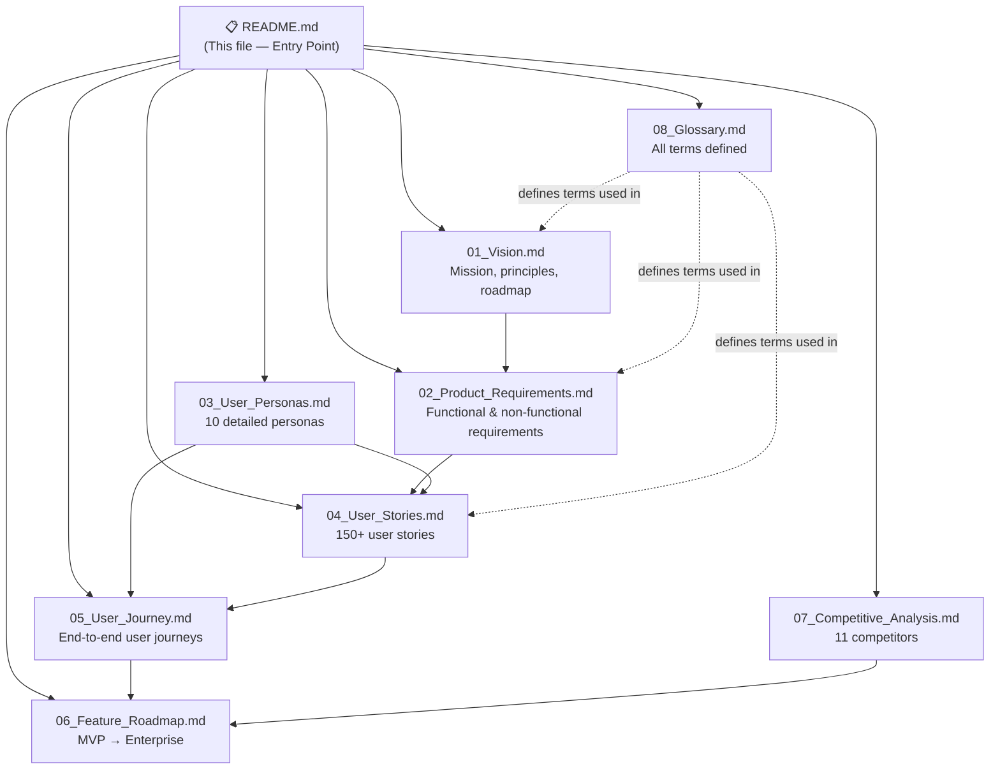

# AI Dashboard Generator — Documentation Index

> **Version:** 1.0  
> **Last Updated:** 2026-06-25  
> **Status:** Active — Single Source of Truth  
> **Audience:** Product, Engineering, Design, AI Coding Agents

---

## Overview

This `/docs` folder is the **single source of truth** for the AI Dashboard Generator SaaS product. Every product decision, requirement, persona, user story, journey, roadmap item, competitive insight, and term definition lives here.

AI coding agents should treat this folder as the authoritative specification before writing any code. Human developers should consult these documents before making architectural or product decisions.

---

## Document Map

---

## Document Index

| # | Document | Purpose | Key Audience | Dependencies |
|---|----------|---------|--------------|-------------|
| — | **README.md** | Navigation index and entry point for humans and AI agents | All | None |
| 01 | [01_Vision.md](01_Vision.md) | Mission, product vision, UVP, design philosophy, success metrics, 3-year roadmap | PM, Founders, Design | None |
| 02 | [02_Product_Requirements.md](02_Product_Requirements.md) | Complete PRD: functional, non-functional, security, scaling, file upload, user roles, subscriptions | Engineering, QA, PM | 01_Vision |
| 03 | [03_User_Personas.md](03_User_Personas.md) | 10 detailed personas with goals, frustrations, workflows and use cases | Design, PM, Marketing | 01_Vision |
| 04 | [04_User_Stories.md](04_User_Stories.md) | 150+ user stories grouped by domain | Engineering, PM, QA | 02_PRD, 03_Personas |
| 05 | [05_User_Journey.md](05_User_Journey.md) | Step-by-step user journeys from landing to retention | Design, Engineering | 03_Personas, 04_Stories |
| 06 | [06_Feature_Roadmap.md](06_Feature_Roadmap.md) | MVP through Enterprise: prioritised feature list with MoSCoW ratings | PM, Engineering | 02_PRD, 04_Stories |
| 07 | [07_Competitive_Analysis.md](07_Competitive_Analysis.md) | Analysis of 11 competitors, market gaps, differentiation strategy | PM, Marketing, Sales | 01_Vision |
| 08 | [08_Glossary.md](08_Glossary.md) | Definitions for all product and technical terms used across all documents | All | None |

---

## How to Use This Documentation

### For AI Coding Agents
1. Start with [01_Vision.md](01_Vision.md) to understand the product philosophy and design constraints.
2. Read [02_Product_Requirements.md](02_Product_Requirements.md) in full before generating any code — it defines behaviour, constraints and acceptance criteria.
3. Consult [08_Glossary.md](08_Glossary.md) whenever a term is ambiguous.
4. Use [04_User_Stories.md](04_User_Stories.md) to derive test cases and acceptance criteria.
5. Use [06_Feature_Roadmap.md](06_Feature_Roadmap.md) to determine what is in scope for the current build phase.

### For Human Developers
1. Read documents in order (01 → 08) for full context.
2. Use the glossary constantly — shared vocabulary is critical.
3. Before raising a PR, verify your change does not contradict any requirement in `02_Product_Requirements.md`.
4. Feature additions must be traceable to a user story in `04_User_Stories.md`.

### For Designers
1. Start with [03_User_Personas.md](03_User_Personas.md) and [05_User_Journey.md](05_User_Journey.md).
2. The design philosophy in [01_Vision.md §6](01_Vision.md) is the governing constraint for all visual decisions.

### For Product Managers
1. [06_Feature_Roadmap.md](06_Feature_Roadmap.md) governs sprint planning and milestone scoping.
2. [07_Competitive_Analysis.md](07_Competitive_Analysis.md) informs positioning and go-to-market messaging.

---

## Consistency Rules

All documents in this folder must:

- Use the product name **AI Dashboard Generator** consistently.
- Reference the same user personas by name (see `03_User_Personas.md`).
- Not contradict requirements stated in `02_Product_Requirements.md`.
- Define new terms in `08_Glossary.md` before using them.
- Use British English spelling throughout.
- Use ISO 8601 date format (`YYYY-MM-DD`).

---

## Versioning

| Version | Date | Author | Change Summary |
|---------|------|--------|----------------|
| 1.0 | 2026-06-25 | Product Team | Initial release — all Phase 1 documents |

---

## Quick Reference: Core Principles

> These principles govern every product and engineering decision. They are derived from [01_Vision.md](01_Vision.md) and must never be violated.

1. **Zero Friction** — Users should never be asked to configure what the AI can infer.
2. **Instant Gratification** — Upload to full dashboard in under 10 seconds for files ≤ 5 MB.
3. **Trustworthy Intelligence** — Every AI insight must include a confidence score and data citation.
4. **Progressive Disclosure** — Surface the simplest view first; complexity is opt-in.
5. **Opinionated Defaults** — Sensible defaults beat endless configuration options.
6. **Radically Simple UX** — If a feature requires a tooltip to understand, it is too complex.
