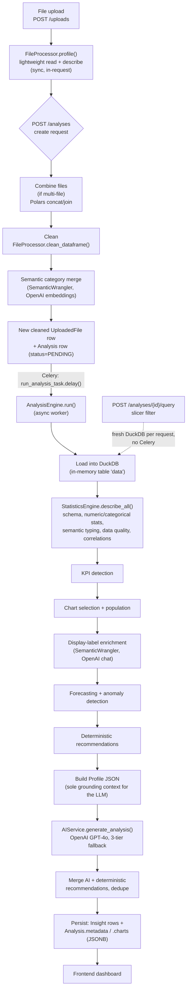

# Data Architecture & ETL

> Scope: how a file becomes a dashboard, stage by stage, as the code actually
> executes it — not the aspirational version. Every claim below is cited to
> `file:line` so it can be checked against the source directly. Where the
> product docs (`docs/*.md`) describe something this pipeline doesn't
> actually do, that's called out explicitly in [§8](#8-known-gaps--engineering-backlog)
> rather than glossed over — an accurate map of a real system is worth more
> to a reviewer than a clean-looking one.

---

## 1. Data sources

| Source | Format | Entry point | Notes |
|---|---|---|---|
| User-uploaded file | `.csv .xlsx .xls .json .parquet .tsv` | `POST /uploads` (`backend/app/api/v1/endpoints/uploads.py:35`) | Up to 512MB (`core/config.py:159`), SHA-256 checksummed, stored at `upload_dir/{user_id}/{uuid}{ext}` |
| Combined multi-file upload | 2+ of the above | `POST /analyses/combined` (`analyses.py:454`) | Resolved to a *single* physical Parquet file before analysis ever runs — see [§6](#6-joins--multi-file-combination) |
| Demo/portfolio dataset | `.csv` | `backend/scripts/demo_data/northwind_outfitters_sales.csv` | Synthetic, generated for this repo's own demos — not a production data source |

There is no live/streaming source, no database connector, and no scheduled ingestion anywhere in the codebase — every analysis originates from one user-initiated file upload. This is a deliberate product boundary (see `docs/02_Product_Requirements.md §14`, "Out-of-Scope"), not a gap.

---

## 2. Pipeline overview

Two facts worth internalizing before reading the stage-by-stage detail:

1. **Cleaning happens before Celery, not inside it.** Combination, deduplication, outlier handling, and semantic category merging all run **synchronously inside the `POST /analyses` request handler** (`analyses.py:344-530`). By the time the Celery task (`AnalysisEngine.run()`) starts, it has zero knowledge of "cleaning" as a concept — it just loads whatever file `analysis.file_id` points to. This ordering is easy to get backwards when describing the system, so it's stated here explicitly.
2. **The analytical engine is DuckDB, not Postgres.** Postgres holds orchestration state and the final JSON output; every statistic, KPI, chart, forecast, and anomaly is computed by DuckDB queries against a single in-memory table. See `docs/analytics/05_Data_Modelling.md` for why that table is not a star schema.

---

## 3. Stage-by-stage trace

### Stage A — Upload (synchronous, `POST /uploads`)
`backend/app/api/v1/endpoints/uploads.py:35-111`

1. Extension allowlist + size check (`uploads.py:20-30`; `core/config.py:159`).
2. SHA-256 checksum computed and stored (`uploads.py:65`).
3. `FileProcessor.profile()` (`file_processor.py:59-95`) — a **lightweight structural pass only**: reads up to `SAMPLE_ROWS = 200_000` rows (`file_processor.py:44`), computes per-column dtype/null/unique/sample values. No cleaning, no dedup, no outlier handling happens at this stage.
4. Row/column metadata written straight to the `uploaded_files` Postgres row.

### Stage B — Cleaning & semantic wrangling (synchronous, `POST /analyses`)
`analyses.py:155-214, 344-530`

Runs in this **exact order** inside `FileProcessor.clean_dataframe()` (`file_processor.py:296-396`):

| # | Step | Function | What it does |
|---|---|---|---|
| 1 | Standardize columns | `standardize_columns` (`file_processor.py:313`) | snake_case renaming |
| 2 | Clean text | `clean_text` (`:325`) | trim/collapse whitespace, null out sentinel tokens (`""`, `"n/a"`, `"unknown"`, ...) |
| 3 | Drop empty | `drop_empty` (`:329`) | remove all-null rows and all-null columns |
| 4 | Normalize dates | `normalize_dates` (`:338`) | parses date-shaped text columns, tries day-first *and* month-first, keeps whichever parses more rows |
| 5 | Parse currency/percent | `parse_currency_percent` (`:349`, `_parse_numeric_text_columns` at `:431`) | converts a column only when whole cells are numeric (prose no longer yields a number — see `09_Verification.md §8`), treats withheld values ("Exempt under Section 43 of the Freedom of Information Act 2000") as missing rather than as evidence against the column, strips `$£€¥%,()` and `k/m/bn` suffixes, casts to float |
| 6 | Handle missing values | `_handle_missing_values` (`:482`) | drops rows missing *every* required numeric metric, then imputes: numeric → median, text → `"Unknown"` |
| 7 | Remove exact duplicates | `remove_duplicates` (`:359`) | `df.unique()` |
| 8 | Remove near-duplicates | `fuzzy_deduplicate` (`:366`) | opt-in; see [§5](#5-deduplication) |
| 9 | Handle outliers | `outlier_policy` (`:376`) | `cap` (IQR winsorize) / `exclude` (IQR row filter) / `keep`; see [§4.3](#43-outlier-handling) |

**Important ordering fact**: type inference (dates, currency) happens *before* deduplication and outlier handling — a row can only be recognized as a near-duplicate or an outlier once its columns are already typed. Coarse numeric coercion (`_cast_numeric_like_columns`, `file_processor.py:923`) happens even earlier still, at file-*read* time, independent of any cleaning options.

If `semantic_categorical_merging` is enabled (default **on**), `SemanticWrangler.canonicalize_cleaned_file()` (`semantic_wrangler.py:77`) runs *after* cleaning and rewrites the cleaned file in place — see [§7](#7-enrichment). **This step makes real, billable OpenAI embedding API calls synchronously inside the HTTP request**, not in the background worker.

A new `uploaded_files` row is created for the cleaned file; the cleaning report is stashed in `Analysis.metadata["upload_context"]["cleaning"]`.

### Stage C — Analysis pipeline (asynchronous, Celery `run_analysis` queue)
`backend/app/workers/tasks.py:48-82` → `backend/app/services/analysis_engine.py:56-126` (`AnalysisEngine`: the database work — steps 1 and 13) → `compute_analysis`, `analysis_engine.py:317-452` (steps 2–12, no database dependency; the calibration benchmark calls the same function — `10_Confidence_Calibration.md §3.1`)

1. Load `Analysis` + `UploadedFile` from Postgres; mark `PROCESSING`.
2. Load the (already-cleaned) file into an in-memory DuckDB table named `data` (`analysis_engine.py:342`).
3. `StatisticsEngine.describe_all()` (`analytics/statistics.py:28-55`) — internal order: `DESCRIBE` schema → numeric stats → categorical stats → **semantic enrichment** (assigns each column a `semantic_type`/`analysis_role` using the stats just computed) → categorical stats recomputed for numeric columns reclassified as dimension/flag codes → **data quality analysis last** (its outlier/negative-value checks are gated on the semantic role already being assigned) → correlations.
4. KPI detection (`kpi_detector.py:44`) — keyword-classifies numeric columns, gated on semantic role.
5. Chart selection (`chart_selector.py:30`) — also gated on semantic role; reuses KPI detector's outcome-column logic.
6. Chart data populated via DuckDB aggregation queries (`analysis_engine.py:455-467`).
7. Display-label enrichment: a **second, separate** LLM call (chat completion, not embeddings) decodes terse column names into human-readable labels and chart titles (`semantic_wrangler.py:257-324`).
8. Forecasting (`analytics/forecasting.py`) and anomaly detection (`analytics/anomaly_detection.py`) run against the now-labeled schema.
9. Deterministic, rule-based recommendations generated — **no LLM involved** (`analytics/recommendations.py`).
10. Profile JSON built and written to disk (`services/data_profile.py`) — this becomes the **sole** grounding context for the AI analysis call. See `docs/analytics/08_AI_Analytics_and_Guardrails.md`.
11. `AIService.generate_analysis()` called, three-tier fallback (Responses API → Chat Completions → fully deterministic template).
12. AI-authored and deterministic recommendations merged and deduplicated by evidence text (`analysis_engine.py:470-491`).
13. Results persisted: old `Insight` rows deleted, new ones written; `Analysis.metadata`/`.charts` (JSONB) updated; status → `COMPLETED`.

Bounded by a 300s soft / 360s hard Celery timeout, retried up to 3× with 30–60s backoff before the analysis is marked `FAILED` (`workers/tasks.py:53-54,79`; `core/config.py:178`).

### Stage D — Live filtering (synchronous, no Celery)
`POST /analyses/{id}/query` (`analyses.py:575-656`)

Opens a **fresh** in-memory DuckDB connection and **re-reads the entire source file from disk on every request** — there is no cached connection or table reused from the original Celery run. Filter values are passed as parameterized `?` placeholders; filter *columns* are validated against an explicit allowlist (`analytics/live_filter.py:25-58`) before ever reaching a SQL string — see [§9](#9-sql-safety-note).

---

## 4. Transformations

### 4.1 Type inference
- **Encoding**: BOM sniff, else `chardet.detect`, falls back to UTF-8 below 45% confidence (`file_processor.py:174`).
- **Delimiter**: `csv.Sniffer` first, then a scored fallback over `\t ; | ,` (`:185`).
- **Header row**: report-style files with title rows above the real header are detected via a grid-continuity heuristic (`:854-910`).
- **Numeric**: string → numeric if ≥85% of non-null values parse; further cast to integer if all values are whole numbers (`:923`).
- **Currency/percent**: strips symbols and magnitude suffixes (`k/m/bn`), ≥85% parse threshold (`:427`).
- **Dates**: mixed-format parsing via pandas, tries both day-first and month-first interpretations and keeps whichever parses more values, ≥70% threshold to accept (`:626, 1311`).

### 4.2 Missing-value strategy ("smart", the default)
`_handle_missing_values`, `file_processor.py:482-556`. Two-phase:
1. Drop rows missing *every* "required" numeric metric — a column is "required" if it's null in <70% of rows (sparser columns are exempt from this drop, `_SPARSE_NUMERIC_METRIC_NULL_RATIO = 0.7`, `:38`).
2. Impute what's left: numeric → median (or interpolate + forward-fill if a date column exists and ≥3 rows); text → literal `"Unknown"`.

### 4.3 Outlier handling
Classic Tukey IQR × 1.5 fence, applied consistently across the codebase (a genuine strength — one formula, not several):
- `cap` → winsorize to the **tighter** of the IQR fence or the 1st/99th percentile (`file_processor.py:706-719`).
- `exclude` → drop the entire row if *any* numeric candidate column is outside its own fence (`:655-680`).
- Both require ≥8 non-null values and a positive IQR per column, else that column is skipped; identifier-like and year-like columns are excluded from consideration (`:1269, 1280`).
- **Independently of whichever policy is chosen**, `data_quality.py`'s IQR check (see `docs/analytics/02_Data_Quality_Framework.md`) always runs as a read-only diagnostic — outliers still surface as a quality "issue" even under `keep`.

---

## 5. Deduplication

| Type | Function | Default | Algorithm |
|---|---|---|---|
| Exact | `remove_duplicates` (`file_processor.py:359`) | **on** | `df.unique()` — full-row exact match |
| Near-duplicate | `_remove_fuzzy_duplicate_rows` (`:558-624`) | **off**, opt-in | Rows sharing an exact signature over non-text columns are compared on a normalized text signature (up to 8 string columns) via `SequenceMatcher`; dropped if similarity ≥ 0.94. **Hard-capped to ≤5,000 rows** — larger datasets are silently skipped (`report["skipped"]`, `:567-570`) |
| Diagnostic (always on, informational) | `_duplicate_count` (`analytics/data_quality.py:167`) | always runs | `GROUP BY` all columns, `HAVING COUNT(*) > 1` — reported as a data-quality issue regardless of whether cleaning-time dedup already ran |

---

## 6. Joins / multi-file combination

Multi-file combination happens **before DuckDB, in Polars** — not as a DuckDB join. `FileProcessor.combine_uploaded_files` (`file_processor.py:1008-1046`):

- **Portfolio strategy**: `pl.concat(frames, how="diagonal_relaxed")` — stacks rows from multiple files into one wide/sparse frame.
- **Join strategy**: `frames[0].join(frame, on=join_columns, how="full", coalesce=True, suffix="_related")` — a full outer join keyed on shared dimension columns, chained across files.

The result is written to **one new Parquet file** and inserted as **one new `uploaded_files` row**; exactly one `analyses` row ever points at exactly one `uploaded_files.id`. The 1:1 `analyses.file_id → uploaded_files.id` foreign key is never violated by this feature — joining is fully resolved before an `Analysis` row exists.

The join is a full outer join with **no orphan/unmatched-key reporting** — see [§8](#8-known-gaps--engineering-backlog).

---

## 7. Enrichment

Two independent OpenAI-backed enrichment steps, distinct from the main analysis call:

1. **Category-value canonicalization** (`semantic_wrangler.py:77-169`, Stage B) — merges near-duplicate category labels ("USA" / "U.S.A." / "United States") via a ~30-entry alias dictionary plus, if enabled, OpenAI `text-embedding-3-small` cosine-similarity clustering (threshold 0.91, `core/config.py:190`).
2. **Display-label generation** (`semantic_wrangler.py:257-324`, Stage C) — a chat-completion call that turns terse column names into human-readable labels and chart titles; falls back to a rule-based humanizer if disabled or the call fails.

Both are clearly separated from `AIService.generate_analysis()` (the narrative/insights call) — see `docs/analytics/08_AI_Analytics_and_Guardrails.md` for the full AI-touchpoint inventory.

---

## 8. Known gaps / engineering backlog

Documenting what a system doesn't yet do is as much a part of data architecture review as documenting what it does. These are real, current gaps, not hypotheticals:

| Gap | Where | Why it matters |
|---|---|---|
| ~~SUM vs. AVERAGE aggregation disagree between KPI tiles and charts~~ — **fixed 2026-09-12** | Both now call `kpi_detector.uses_average_aggregation()`; `chart_selector._aggregation()` delegates to it. Previously the two kept separate keyword lists, so `total_profit` (or `total_orders`, `mrr`, `arr`, `gmv`) was summed for its KPI card but averaged for its chart. Already-averaged names (`avg`, `mean`, `median`, `aov`) now average on both sides — a demo dashboard had shown "Avg Order Value $46,919.50", a sum of averages. | Was a real correctness risk: the tile and the chart built from the same column could show materially different numbers. Regression test: `test_kpi_tiles_and_charts_agree_on_aggregation`. |
| **Currency/percentage detection duplicated 3× with drifting keyword lists** | `file_processor.py:_looks_like_currency_column` (`:1272`), `kpi_detector.py:_is_currency` (`:143`), `semantic_detector.py` RULES (`:28`) — all three now match whole words through `analytics/text_matching.py:24`, and which currency it is comes from `_detect_currency` (`file_processor.py:1233`) | A column can be treated as currency at one pipeline stage and not another — three lists still drift, though they no longer disagree about word boundaries. |
| **`_quote_identifier` reimplemented 5 times** | `statistics.py:263`, `data_quality.py:216`, `anomaly_detection.py:176`, `forecasting.py:107`, `live_filter.py:34` — identical 2-line function each time | Straightforward to consolidate into one shared `analytics/sql_utils.py`; flagged, not yet fixed, to keep this change-set behavior-neutral. |
| **Live-filter re-reads the source file from disk on every slicer click** | `analyses.py:610-617` | No cached DuckDB connection/table is reused between the original Celery run and later filter requests — full file I/O + reparse per request. |
| **Multi-file join has no orphan-key reporting** | `file_processor.py:1047-1105` | A full outer join silently produces unmatched rows on either side with no count surfaced to the user. |
| **Confidence scores are largely hand-authored, not calibrated** | See `docs/analytics/08_AI_Analytics_and_Guardrails.md §"Confidence scoring"` | Recommendation confidence is a fixed priority→number lookup table, not a measured accuracy rate. |
| **`sandboxed_code_executor.py` is complete but unwired** | `services/sandboxed_code_executor.py`, 219 lines, not imported anywhere outside its own tests | Dead scaffolding for a feature (`ai_code_execution_enabled`) that defaults off and was never integrated into the pipeline. |
| **`GET /insights` is a stub** | `api/v1/endpoints/insights.py` — returns `[]` unconditionally | Real insights are served via `GET /analyses/{id}`; this route is unreachable dead code. |
| **Data Quality Score is a flat scalar, not the per-dimension breakdown the product docs describe** | See `docs/analytics/02_Data_Quality_Framework.md` | `docs/02_Product_Requirements.md` (`FR-PROC-11`) and `docs/08_Glossary.md` describe a dimension-by-dimension score; the implementation returns a single 0–100 int. |

None of these were changed as part of this documentation/quality pass — the instruction was explicitly to document and improve *readability and process*, not behavior. They're listed here as the honest starting point for a follow-up engineering pass.

---

## 9. SQL safety note

Every DuckDB query in the analytics layer quotes column identifiers before interpolation (`_quote_identifier`, duplicated as noted above) and the live-filter module goes further — column names are checked against an explicit role allowlist (`ALLOWED_FILTER_ROLES`, `live_filter.py:38-58`) and filter *values* are always passed as `?` parameters, never string-interpolated (`live_filter.py:1-8` module docstring: *"never let an unvalidated column name reach raw SQL"*). `file_processor.py`'s DuckDB loading queries (`:977-999`) interpolate file paths and the fixed table name `"data"` directly without `_quote_identifier` — safe today only because those values are always server-generated (UUID filenames, a hardcoded table name), never user input. See `docs/analytics/04_SQL_Standards.md` for the full query-by-query review.
