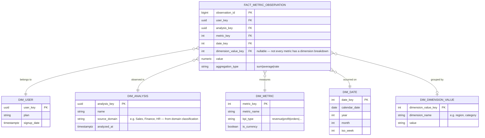

# Data Modelling

Two genuinely different data models coexist in this system, at two different
layers, and they should not be described as one thing:

1. A **normalized OLTP schema in PostgreSQL** — 7 tables, real foreign keys,
   real cascade behavior. This is what's actually implemented, and it's
   documented in full below.
2. An **ephemeral, single-table analytical layer in DuckDB** — one wide
   table per analysis run, in memory only. There is no fact/dimension split
   and no star schema anywhere in the running system.

A proposed dimensional model for what a *multi-tenant analytics warehouse*
version of this product could look like is included at the end, clearly
marked as a proposal — not a description of what ships today.

---

## 1. PostgreSQL schema — entity relationship diagram

```mermaid
erDiagram
    USERS ||--o{ UPLOADED_FILES : owns
    USERS ||--o{ ANALYSES : owns
    USERS ||--o| SUBSCRIPTIONS : has
    UPLOADED_FILES ||--o{ ANALYSES : "source file for"
    ANALYSES ||--o{ INSIGHTS : contains
    ANALYSES ||--o{ CHAT_SESSIONS : has
    CHAT_SESSIONS ||--o{ CHAT_MESSAGES : contains
    USERS ||--o{ RECOMMENDATION_FEEDBACK : gives
    ANALYSES ||--o{ RECOMMENDATION_FEEDBACK : "collects"
    INSIGHTS |o--o{ RECOMMENDATION_FEEDBACK : "rated in (nulled on re-run)"

    USERS {
        uuid id PK
        string supabase_id UK "unique, indexed"
        string email UK "unique, indexed"
        string full_name
        string avatar_url
        string plan "free|starter|professional|enterprise"
        boolean is_active
        boolean is_verified
        int analyses_this_month
        int ai_queries_this_month
        int storage_used_bytes
        timestamptz created_at
        timestamptz updated_at
    }
    UPLOADED_FILES {
        uuid id PK
        uuid user_id FK "-> users.id, ON DELETE CASCADE, indexed"
        string filename
        string original_filename
        bigint file_size
        string mime_type
        string storage_path
        int row_count
        int column_count
        jsonb columns "per-column profile snapshot"
        string checksum "sha-256"
    }
    ANALYSES {
        uuid id PK
        uuid user_id FK "-> users.id, ON DELETE CASCADE, indexed"
        uuid file_id FK "-> uploaded_files.id, ON DELETE CASCADE, NOT indexed"
        string name
        string status "pending|processing|completed|failed, indexed"
        int progress "0-100"
        text summary
        text error_message
        string celery_task_id
        string share_token UK "nullable, unique, indexed"
        int row_count
        int column_count
        jsonb metadata "Profile JSON, schema, data quality, forecasts, anomalies"
        jsonb charts "chart configs"
    }
    INSIGHTS {
        uuid id PK
        uuid analysis_id FK "-> analyses.id, ON DELETE CASCADE, indexed"
        string type "summary|ai_insight|forecast|anomaly|recommendation"
        string title
        text description
        string importance "low|medium|high"
        float confidence "0.0-1.0, see docs/analytics/03_Analytics_Glossary.md §8"
        int sort_order
        jsonb data
        jsonb chart_config
    }
    CHAT_SESSIONS {
        uuid id PK
        uuid analysis_id FK "-> analyses.id, ON DELETE CASCADE, indexed"
        string title "defaults to 'New conversation'"
    }
    CHAT_MESSAGES {
        uuid id PK
        uuid session_id FK "-> chat_sessions.id, ON DELETE CASCADE, indexed"
        string role "user|assistant, not DB-enforced"
        text content
        jsonb chart_config
        jsonb internal_metadata
    }
    SUBSCRIPTIONS {
        uuid id PK
        uuid user_id FK UK "-> users.id, ON DELETE CASCADE, unique (1:1)"
        string plan
        string status "active|..., default 'active'"
        string stripe_customer_id UK
        string stripe_subscription_id UK
        string current_period_start "stored as string, not timestamptz"
        string current_period_end "stored as string, not timestamptz"
        boolean cancel_at_period_end
    }
    RECOMMENDATION_FEEDBACK {
        uuid id PK
        uuid user_id FK "-> users.id, ON DELETE CASCADE, indexed"
        uuid analysis_id FK "-> analyses.id, ON DELETE CASCADE, indexed"
        uuid insight_id FK "-> insights.id, ON DELETE SET NULL, nullable"
        string verdict "helpful|not_helpful, CHECK-enforced"
        string recommendation_title "snapshot"
        string importance "snapshot"
        float confidence "snapshot: the confidence shown"
        string confidence_source "snapshot, e.g. ai:high, indexed"
        string confidence_method "snapshot: measured|default"
    }
```

Every table also carries `id` (UUID, PK), `created_at`, `updated_at` via a shared `UUIDMixin`/`TimestampMixin` (`backend/app/db/mixins.py:11-34`). Source: `backend/app/models/*.py`, migrations `backend/alembic/versions/001_initial.py`, `002_add_share_token.py`, `003_recommendation_feedback.py`.

There are **no many-to-many relationships anywhere** in this schema — every relationship is a plain one-to-many (or one-to-one for `users↔subscriptions`), each via a single foreign-key column. No junction tables exist. Every foreign key is `ON DELETE CASCADE` except one, deliberately: `recommendation_feedback.insight_id` is `ON DELETE SET NULL`, because a re-run deletes and regenerates an analysis's insights and the verdict must outlive the card it was given on. Its snapshot columns (`confidence`, `confidence_source`, …) are intentional denormalization for the same reason — see `10_Confidence_Calibration.md §6`.

Migration 003 also adds the schema's first **view**, `recommendation_calibration`: per confidence source, the count, mean confidence shown, helpful rate, and Brier score of owner feedback.

---

## 2. Table-by-table reference

| Table | Row represents | Cardinality to parent |
|---|---|---|
| `users` | An authenticated account (provisioned on first Supabase-verified login) | root entity |
| `uploaded_files` | One physical file on disk — the raw upload **and** every derived file (cleaned copy, combined copy) each get their own row | many per user |
| `analyses` | One pipeline run against one `uploaded_files` row | many per user, many per file (a file can be re-analyzed via `/rerun`) |
| `insights` | One dashboard card — a KPI summary, an AI insight, a forecast, an anomaly, or a recommendation, distinguished by `type` | many per analysis |
| `chat_sessions` | One conversation thread attached to an analysis | many per analysis |
| `chat_messages` | One turn in a chat session | many per session |
| `subscriptions` | One billing record per user | exactly 0 or 1 per user |
| `recommendation_feedback` | One owner's helpful / not-helpful verdict on one recommendation, with a snapshot of the confidence it was shown with | many per analysis; at most one per (insight, user) |

**A note on `uploaded_files`**: this table is not "the raw file" in a 1:1 sense — cleaning, semantic wrangling, and multi-file combination each produce a *new* Parquet/CSV file and a *new* `uploaded_files` row (`docs/analytics/01_Data_Architecture.md §3`, Stage B). A single upload interaction from the user's perspective can produce 2-3 `uploaded_files` rows before an `Analysis` ever exists. This is worth knowing when reasoning about storage growth.

---

## 3. Indexes

| Index | Column(s) | Unique |
|---|---|---|
| `ix_users_supabase_id` | `users.supabase_id` | No *(see note)* |
| `ix_users_email` | `users.email` | No *(see note)* |
| `ix_uploaded_files_user_id` | `uploaded_files.user_id` | No |
| `ix_analyses_user_id` | `analyses.user_id` | No |
| `ix_analyses_status` | `analyses.status` | No |
| `ix_analyses_share_token` | `analyses.share_token` | **Yes** |
| `ix_insights_analysis_id` | `insights.analysis_id` | No |
| `ix_chat_sessions_analysis_id` | `chat_sessions.analysis_id` | No |
| `ix_chat_messages_session_id` | `chat_messages.session_id` | No |
| *(implicit)* | `subscriptions.user_id` | Yes (unique constraint) |
| *(implicit)* | `subscriptions.stripe_customer_id` | Yes |
| *(implicit)* | `subscriptions.stripe_subscription_id` | Yes |
| `ix_recommendation_feedback_user_id` | `recommendation_feedback.user_id` | No |
| `ix_recommendation_feedback_analysis_id` | `recommendation_feedback.analysis_id` | No |
| `ix_recommendation_feedback_confidence_source` | `recommendation_feedback.confidence_source` | No |
| `uq_recommendation_feedback_insight_user` | `recommendation_feedback.(insight_id, user_id)` | **Yes** — the upsert target |

### Modelling review notes

- **`analyses.file_id` has a foreign key but no index.** Every join from an analysis back to its source file (`analyses.py`'s file-reuse checks, the `/rerun` path) does an unindexed lookup on this column. Conventionally, FK columns used in joins are indexed — this one isn't, in either the model or the migration. Flagged, not changed, to keep this pass behavior-neutral; it's a one-line `op.create_index` if picked up.
- **`users.supabase_id` and `users.email` carry a redundant second index.** Each is declared `unique=True, index=True` on the same column, which produces *two* indexes: an implicit unique-constraint index plus an explicit non-unique `ix_...` index covering the same column. Harmless, but duplicate.
- **`subscriptions.user_id` is missing its explicit index.** The model declares `index=True` (implying an `ix_subscriptions_user_id` should exist), but the migration only creates the `unique=True` constraint, with no matching `op.create_index` call — unlike every other indexed column in the same migration file. Functionally fine (a unique constraint is backed by an index in PostgreSQL), but the schema the migrations actually produce isn't byte-for-byte what the ORM models describe — a real, minor model/migration drift.
- **Almost no DB-level `ENUM` or `CHECK` constraints.** `AnalysisStatus`, `SubscriptionPlan`, and `chat_messages.role` are all Python-only enums; the columns are plain `VARCHAR`. A hand-crafted `UPDATE analyses SET status = 'compelted'` would insert silently. Worth a `CHECK` constraint or native `ENUM` if this schema were hardening for production multi-tenant use. The one exception is the newest table: `recommendation_feedback.verdict` carries `ck_recommendation_feedback_verdict` (migration 003) — the pattern the older enum columns could follow.

---

## 4. Normalization

The PostgreSQL schema is in **third normal form (3NF)** for its relational columns: every table has a single-column surrogate key (no composite-key partial-dependency risk), and no non-key column depends on another non-key column (no transitive dependencies — e.g. `analyses.user_id` is a direct FK, not derived from `analyses.file_id → uploaded_files.user_id`, even though that path also identifies the owner).

The JSONB columns (`uploaded_files.columns`, `analyses.metadata`, `analyses.charts`, `insights.data`, `insights.chart_config`, `chat_messages.chart_config`/`internal_metadata`) are a **deliberate, controlled denormalization** — semi-structured analysis output (a full Profile JSON, a chart's ECharts option tree) doesn't have a natural fixed relational shape, and normalizing it into rows would mean modelling a schema-of-a-schema for no query benefit, since nothing currently queries *inside* these blobs from SQL — they're read whole and served to the frontend. This is a standard, defensible pattern (Postgres JSONB, not a document database bolted on) rather than a normalization failure.

**One genuine redundancy** worth flagging (also noted in `docs/analytics/01_Data_Architecture.md §4`): the full Profile JSON exists in three places simultaneously — a `.profile.json` file on disk, inline inside `analyses.metadata["data_profile"]`, and transiently in memory during the AI call. This is intentional (disk copy for the AI/export path, DB copy for cheap API reads) but it is duplication, and a future iteration might make one of these the canonical source and derive the others.

---

## 5. The DuckDB analytical layer — why it isn't a star schema

Every uploaded file becomes exactly **one wide table, named `data`, in an in-memory DuckDB connection** (`backend/app/services/file_processor.py:977-999`, confirmed as the only table name used anywhere: `analytics/statistics.py:24-26`, `analysis_engine.py:338`, `analyses.py:610`). There is no separate fact table, no dimension tables, and no DuckDB-level joins — multi-file "combination" is resolved to a single physical Parquet file **before** DuckDB ever sees it (Polars-level concat/join, `docs/analytics/01_Data_Architecture.md §6`).

This is the correct design for what the product does: a single uploaded spreadsheet **is** naturally a flat table — it has no separate grain for "customer" vs. "order" vs. "date" the way an operational data warehouse would. Building a star schema over a single flat file would add modelling overhead with no query benefit, since DuckDB already answers every aggregate query the dashboard needs directly against that one table.

The connection itself is fully ephemeral: created fresh per Celery task run or per live-filter HTTP request, never persisted to disk, closed at the end of the request (`analysis_engine.py:338`, closed in `compute_analysis`'s `finally`; `analyses.py:610,648-649`). Nothing about the analytical layer survives between requests except the JSON already written back to Postgres.

---

## 6. Proposed dimensional model *(not implemented — a roadmap sketch)*

If this product grew to support **cross-analysis reporting** — "show me revenue trends across every dataset this user has ever uploaded," which nothing in the current system can answer, since each analysis is an isolated silo — the natural next step is a conventional star schema sitting *alongside* (not replacing) the current per-analysis DuckDB layer:



Why this shape specifically:

- **`fact_metric_observation` is the one true fact table** — a single grain (one row per metric, per date, per optional dimension breakdown, per analysis) that every KPI, chart, and forecast in the current system could populate into, instead of living only inside per-analysis JSONB blobs.
- **`dim_metric` normalizes what's currently a keyword-matched `kpi_type` string computed independently in three files** (`docs/analytics/01_Data_Architecture.md §8`) — making it a real dimension table would force the currency/aggregation-type drift documented there to be resolved once, in one place, rather than three.
- **`dim_date` is a conformed date dimension** — the current system computes `DATE_TRUNC('month', ...)` ad hoc in three different DuckDB queries (forecasting, anomaly detection, and any future trend chart); a shared date dimension is the standard fix.
- **`dim_dimension_value` is deliberately generic** (an EAV-style "dimension name + value" pair) rather than one column per possible business dimension, because unlike a hand-modelled warehouse, the *set* of dimensions varies per uploaded file (`region` in one dataset, `department` in another) — this is the one place a textbook star schema needs adapting to fit a zero-configuration product where the schema isn't known in advance.

This would be an **additive** system sitting beside the current one — `analyses.metadata` would stay as the fast-path single-analysis read the dashboard already depends on; the fact table would be populated as a secondary write at the end of the existing pipeline (`analysis_engine.py:_persist_results`) for the specific new cross-analysis use case. Explicitly not something to build without a real product requirement driving it — included here to demonstrate the modelling, not as a recommendation to build it speculatively.
